# Technical Walkthrough

## Step 1 – Create Fabric Workspace

A new Microsoft Fabric workspace was created with Fabric capacity enabled.

Purpose: Workspaces provide an isolated environment for managing Fabric assets such as pipelines, notebooks, and lakehouses.

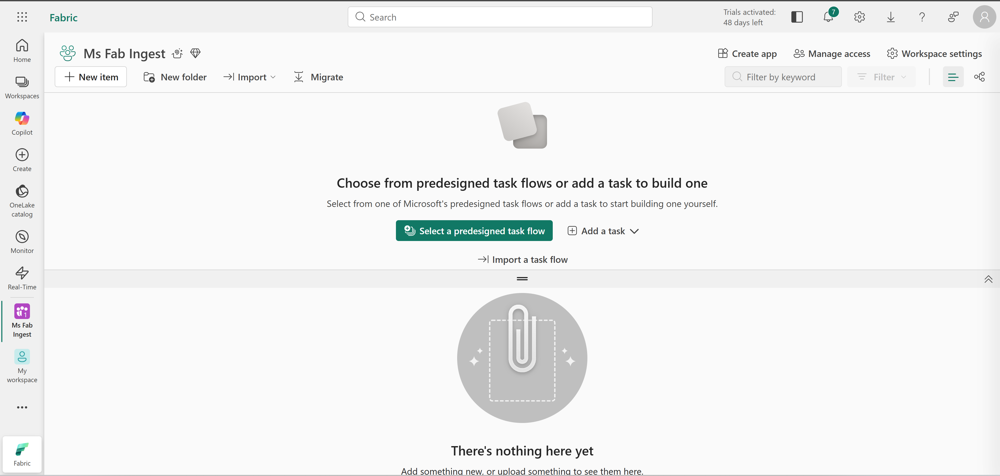

---

## Step 2 – Create a Lakehouse

A Fabric Lakehouse was created inside the workspace.

Configuration: Lakehouse schemas disabled.

A folder named **new_data** was created under the Files section.

Purpose: The lakehouse acts as the central storage layer for both raw and processed data.

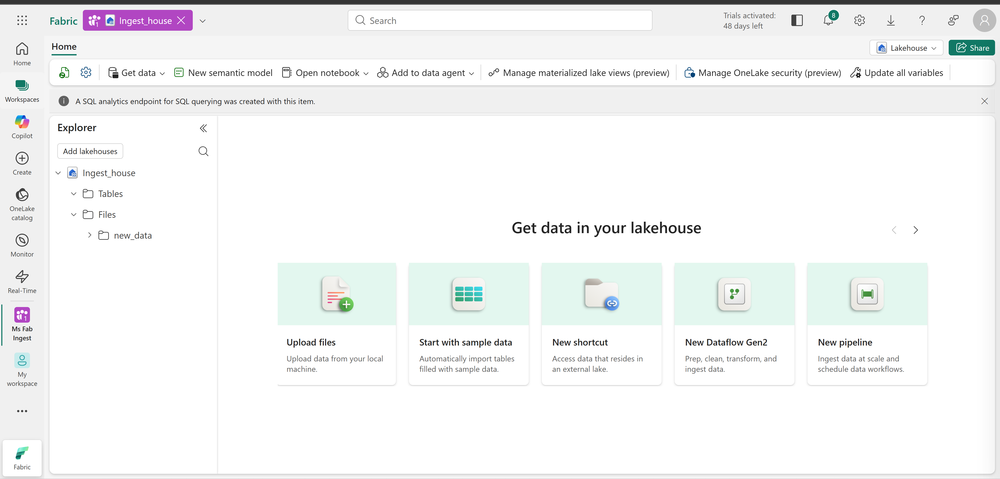

---

## Step 3 – Create Data Pipeline

A new pipeline named **Ingest Sales Data** was created.

A **Copy Data activity** was configured to ingest data from an external HTTP source.

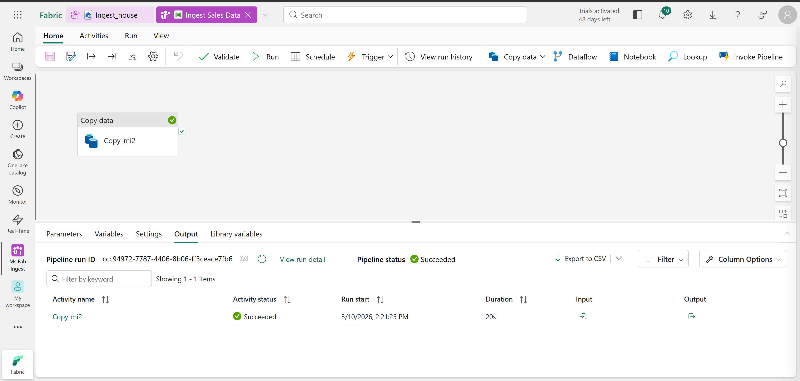

Source dataset:
```
https://raw.githubusercontent.com/MicrosoftLearning/dp-data/main/sales.csv
```

Destination: Lakehouse storage `Files/new_data/sales.csv`

Purpose: This activity copies the raw dataset into **OneLake storage**.

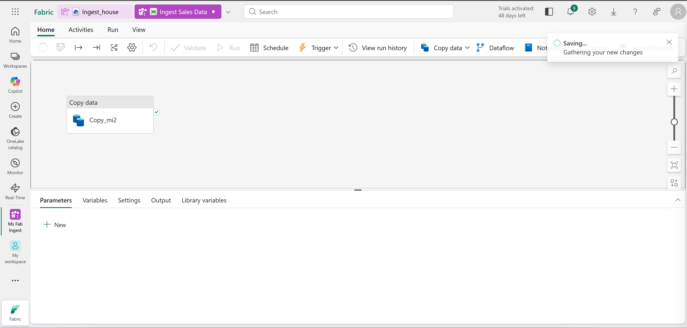

---

## Step 4 – Verify Data Ingestion

After running the pipeline, the dataset was confirmed in: `Lakehouse → Files → new_data → sales.csv`

This verified successful ingestion of the raw dataset.

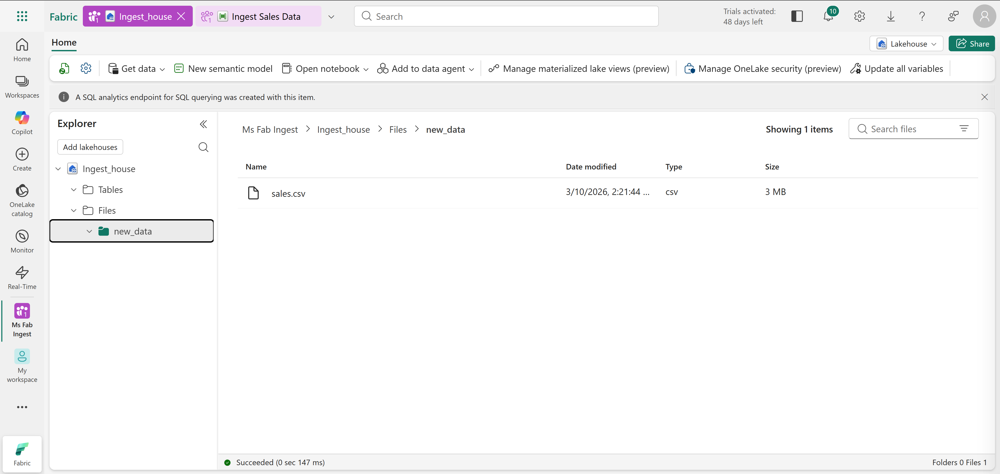

---

## Step 5 – Create Spark Notebook

A new Fabric notebook was created.

The notebook included a **parameter cell** defining the destination table name.

`table_name = "sales"`

This enables dynamic execution when the notebook is triggered from a pipeline.

---

## Step 6 – Implement Data Transformation (PySpark)

The notebook reads the raw dataset and applies several transformations.

Key operations include:

- Reading CSV files from the lakehouse Files directory
- Deriving Year and Month from OrderDate
- Splitting CustomerName into FirstName and LastName
- Reordering selected columns
- Writing results to a Delta table

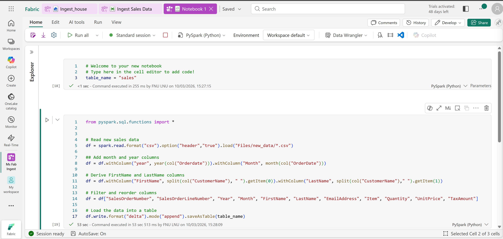

The full notebook code used in this exercise is available in this folder: `/code/load_sales_notebook.py`

This script contains the PySpark logic used to transform the ingested dataset and load it into a Delta table in the Fabric Lakehouse.

---

## Step 7 – Validate Notebook Execution

The notebook was executed manually.

Result: A new table named **sales** was created in the Lakehouse.

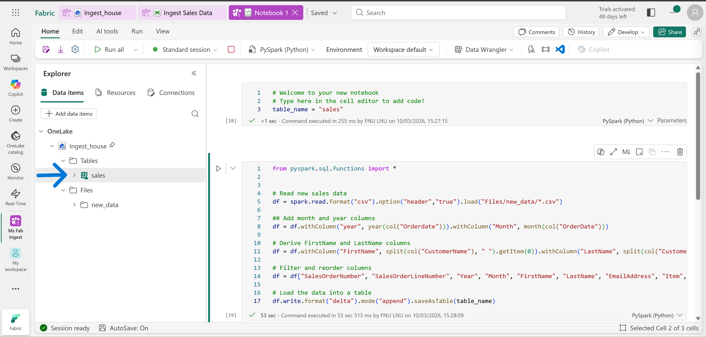

---

## Step 8 – Modify the Pipeline

The pipeline was extended to orchestrate the entire ETL workflow.

**New activities added:**

1. Delete Data activity  
Removes existing CSV files before ingestion.

2. Copy Data activity  
Copies fresh dataset from external source.

3. Notebook activity  
Runs the Spark notebook transformation.

Pipeline workflow: Delete files → Copy data → Run notebook

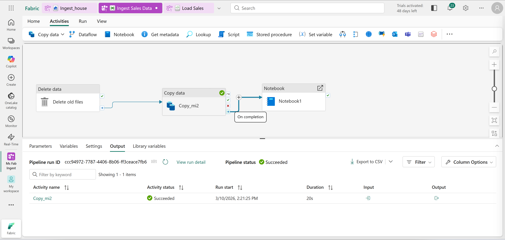

---

## Step 9 – Parameterize Notebook Execution

The pipeline passes a parameter to the notebook: `table_name = new_sales`

This overrides the default table name and writes output to: `Lakehouse Tables → new_sales`

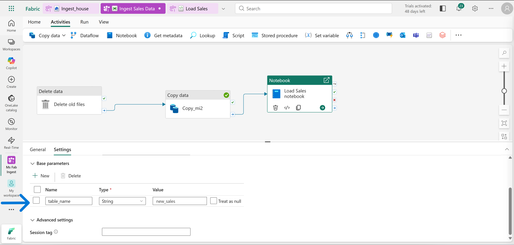

---

## Step 10 – Execute Pipeline

The full pipeline was executed.

All activities completed successfully.

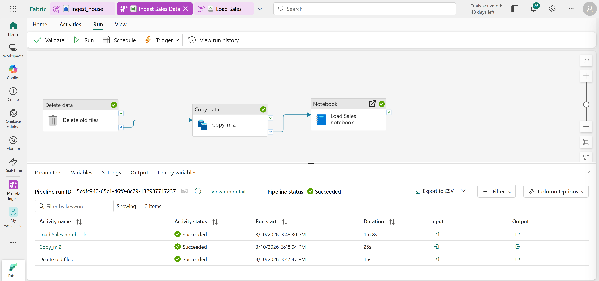

Final result: A new **Delta table (new_sales)** was created in the Lakehouse.

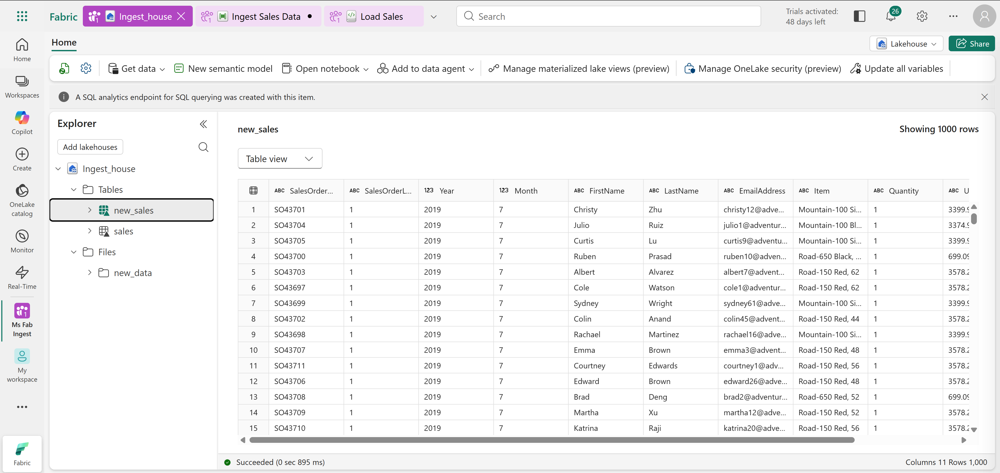

---

## Step 11 – Clean Up Resources

The Fabric workspace was deleted to remove all created resources.

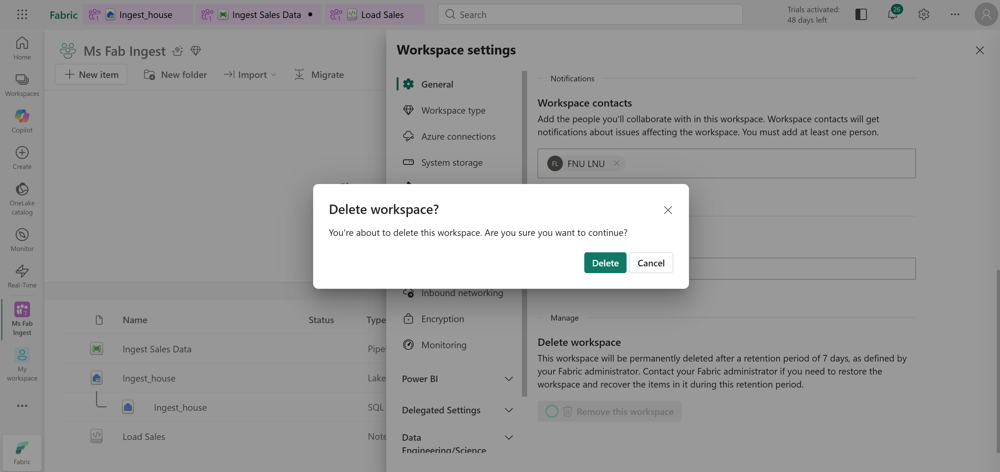


