# Technical Breakdown

## Step 1 - Create Fabric Workspace

A new Microsoft Fabric workspace was created with Fabric capacity enabled.

Purpose: The workspace provides an isolated environment for managing Fabric assets such as lakehouses and notebooks.

---

## Step 2 - Create Lakehouse

A new Fabric Lakehouse was created within the workspace.

Configuration: Lakehouse schemas disabled.

Purpose: The lakehouse acts as the central data storage layer using OneLake.

---

## Step 3 - Upload Source Data

A dataset containing order data for multiple years was downloaded and uploaded to the lakehouse.

Dataset: [orders.zip](https://github.com/MicrosoftLearning/dp-data/raw/main/orders.zip)

Contents:
- 2019.csv
- 2020.csv
- 2021.csv

Files uploaded to: Lakehouse → Files → orders

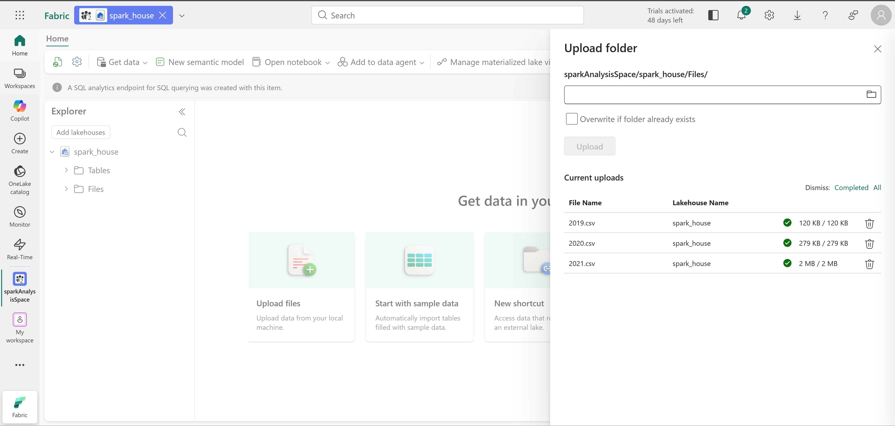

---

## Step 4 - Create Fabric Notebook

A new Fabric notebook was created to perform Spark-based analysis.

Notebook structure:

- Markdown introduction
- PySpark code cells
- Data exploration and visualization

  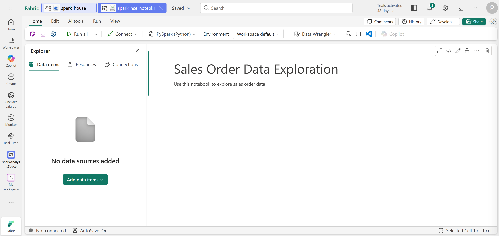

---

## Step 5 - Create Spark DataFrame

A Spark DataFrame was created by loading CSV files from the lakehouse storage.

Purpose: The wildcard path loads data from multiple CSV files into a single DataFrame.

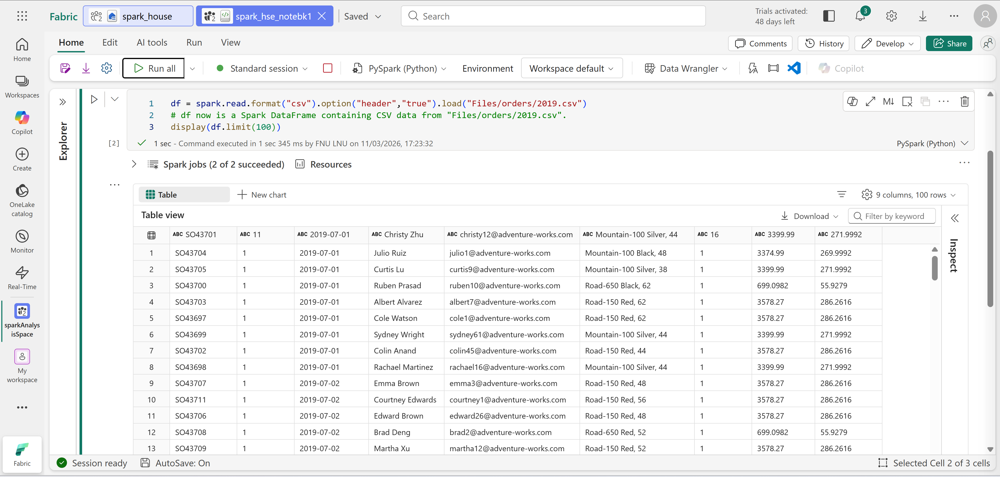

---

## Step 6 - Explore Data Using DataFrame Operations

Several DataFrame operations were performed:

- Column selection
- Filtering
- Distinct values
- Record counting

Purpose: To explore and summarize customer information.

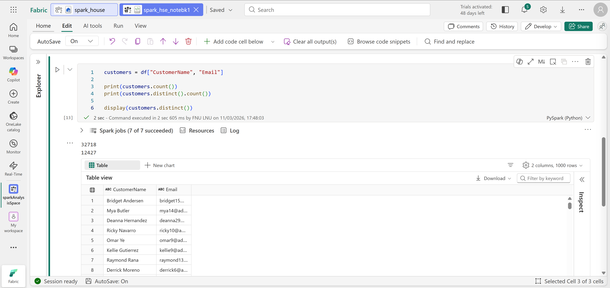

---

## Step 7 - Aggregate and Group Data

Spark SQL functions were used to perform aggregations.

This produced total quantities sold per product.

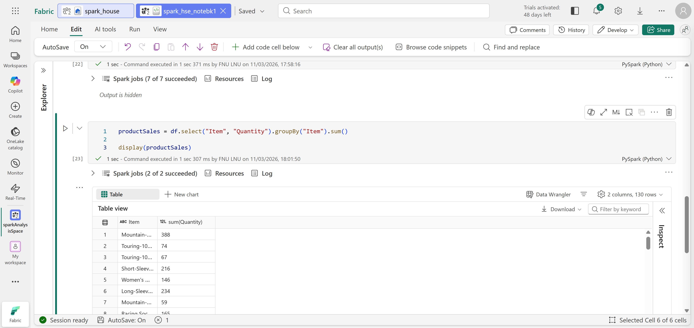

---

## Step 8 - Transform Data

Additional transformations were applied to enrich the dataset.

Transformations included:

- Extracting Year and Month from OrderDate
- Splitting CustomerName into FirstName and LastName
- Reordering columns

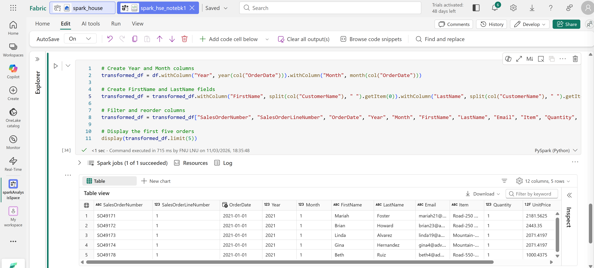

---

## Step 9 - Save Transformed Data

The transformed dataset was saved in **Parquet format**.

Purpose: Parquet provides efficient columnar storage optimized for analytics.

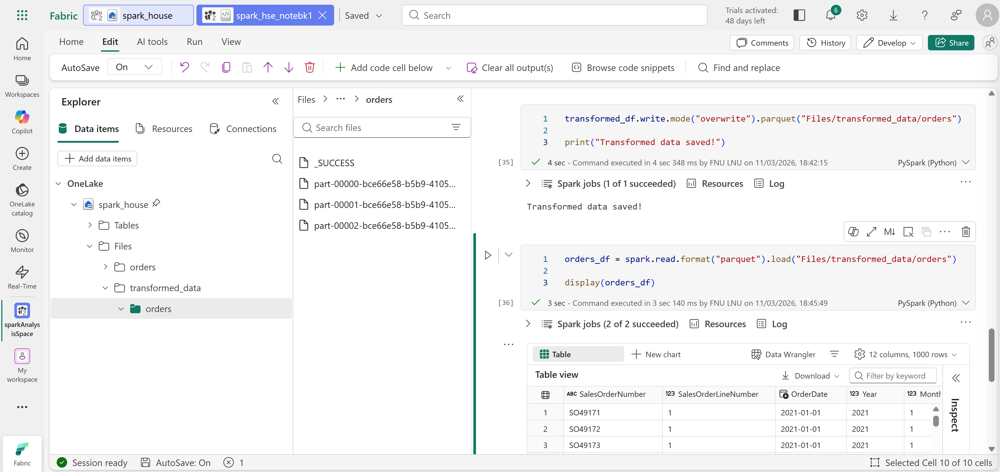

---

## Step 10 - Partition Data

To improve performance, the dataset was partitioned.

Partition columns:
- Year
- Month

Partitioning improves query performance by reducing data scanned.

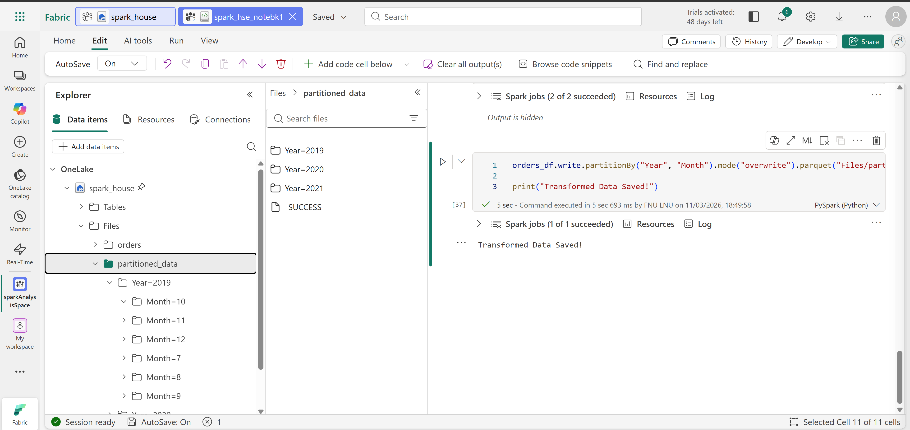

---

## Step 11 - Create Delta Table

The dataset was stored as a Delta Lake table.

Purpose: Delta tables support transactions, schema enforcement, and ACID operations.

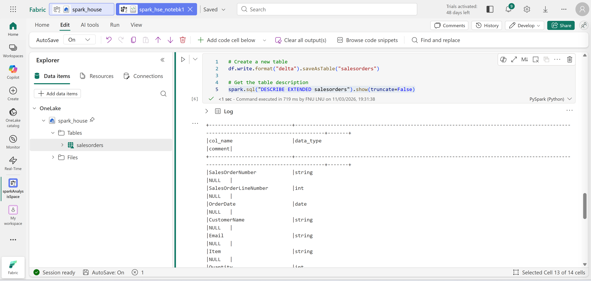

---

## Step 12 - Query Using Spark SQL

SQL queries were executed directly against the Delta table.

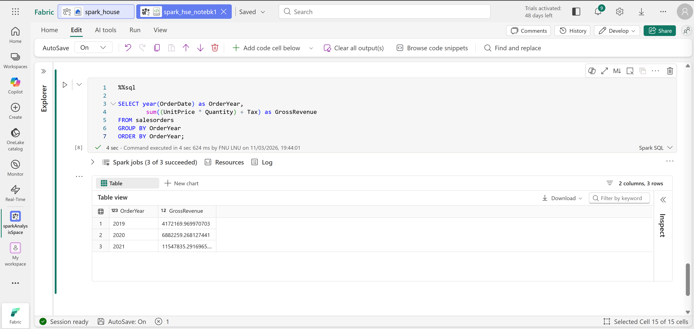

---

## Step 13 - Visualize Data

Data was visualized using:
- Notebook chart builder
- Matplotlib
- Seaborn

Example visualization: Revenue by year.

Purpose: To analyze patterns and trends in sales data.

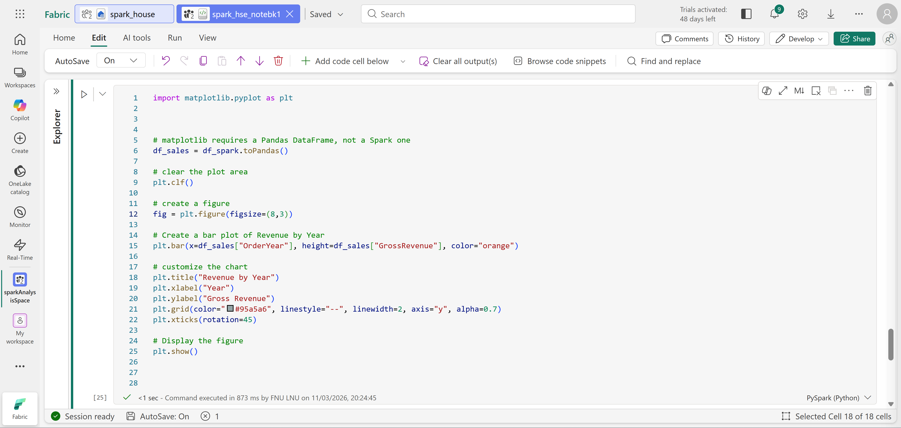
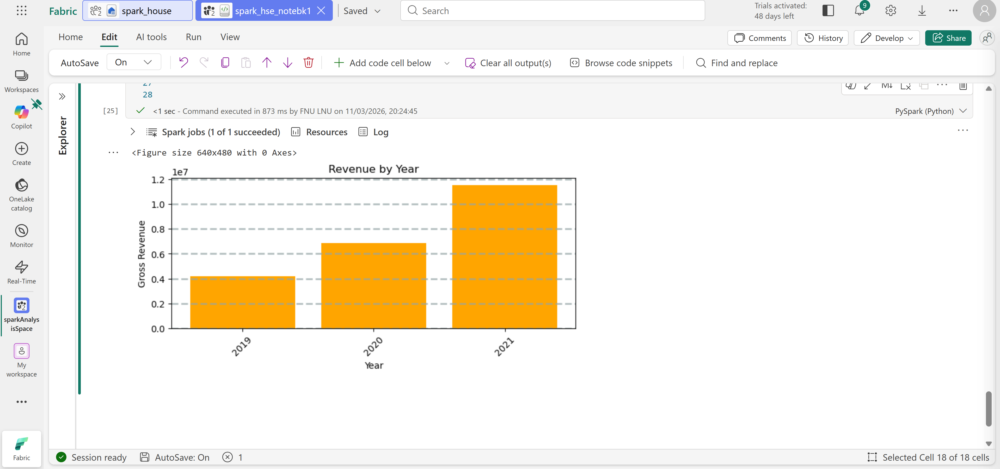

---

## Step 14 - Clean Up Resources

After completing the exercise, the Fabric workspace was deleted to remove all created resources.
