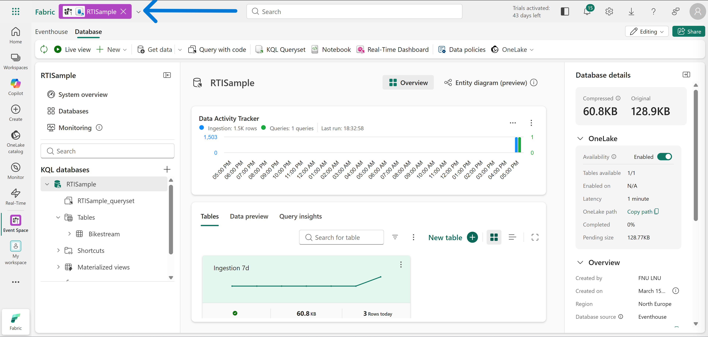
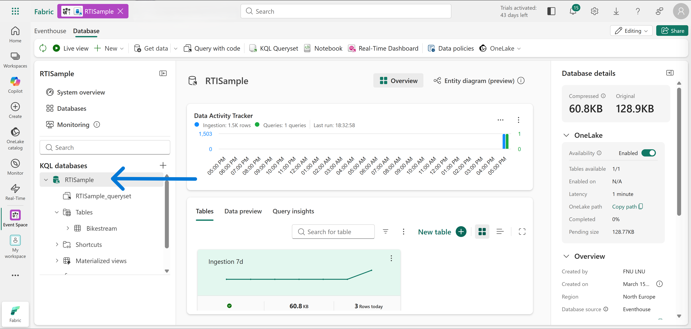
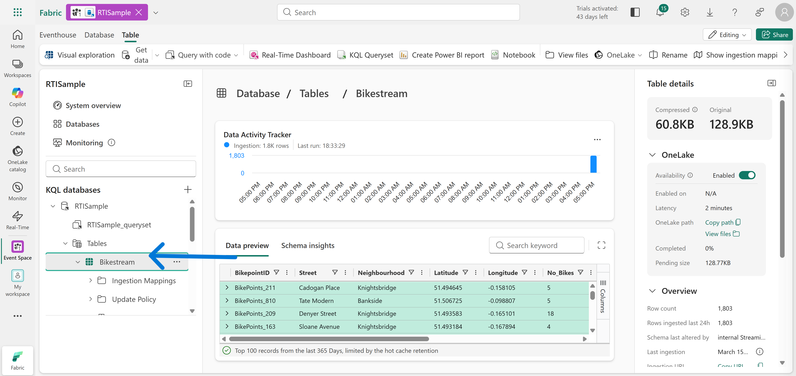
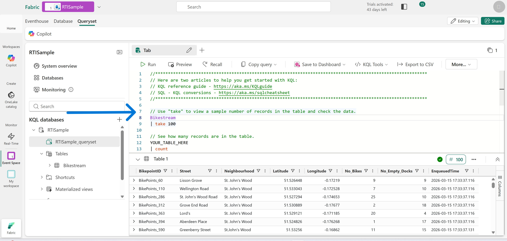
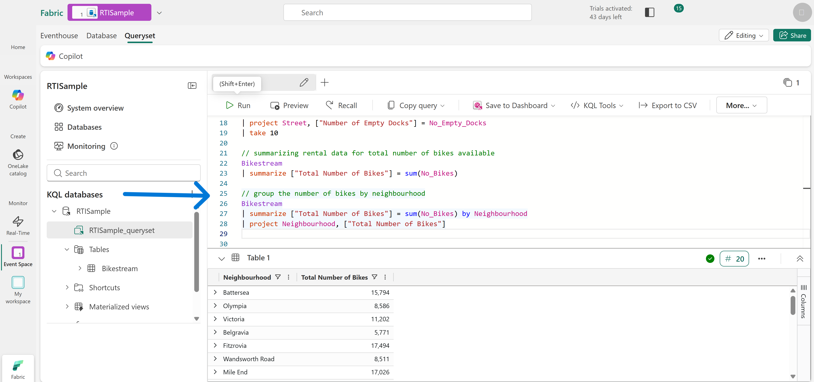
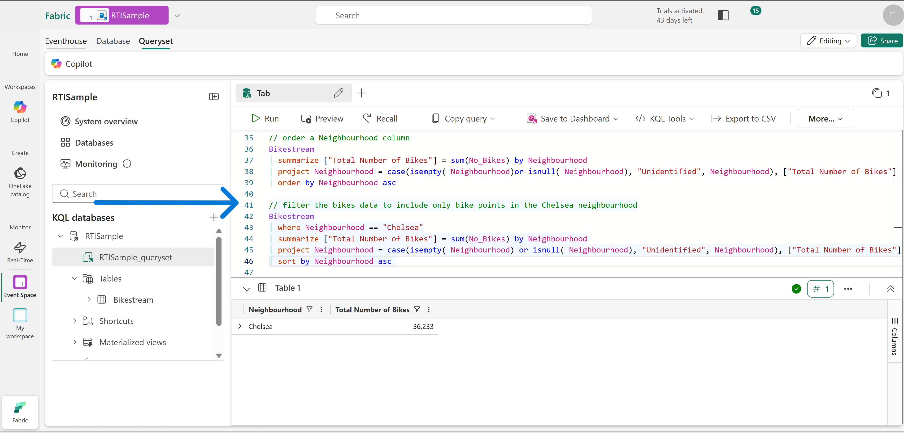
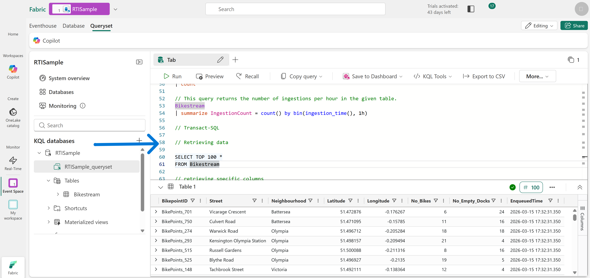

# Technical Breakdown 

## Step 1 – Create Fabric Workspace

A new Fabric workspace was created with Fabric capacity enabled.

Purpose: The workspace provides a container for Real-Time Intelligence resources such as Eventhouses.

---

## Step 2 – Enable Real-Time Intelligence

From the Fabric workload menu: Workloads → Real-Time Intelligence

The Real-Time Intelligence environment provides tools for streaming analytics and event-driven data workloads.

---

## Step 3 – Create Eventhouse

A sample Eventhouse was created by selecting: **`Explore Real-Time Intelligence Sample`**

Fabric automatically deployed: Eventhouse: **RTISample**



---

## Step 4 – Explore KQL Database

The Eventhouse contains a **KQL database** with the same name.


Inside the database a table named: `Bikestream` was automatically created and populated with sample event data.



---

# Kusto Query Language (KQL) Queries

## Step 5 – Query Data Using KQL

The dataset was explored using Kusto Query Language.

Purpose: Retrieve sample records to understand dataset structure.



---

## Step 6 – Select Specific Columns

Columns were selected using the `project` operator.

Example:
```
Bikestream
| project Street, No_Bikes
| take 10
```

---

## Step 7 – Rename Columns

Columns were renamed to improve readability.

Example:
```
Bikestream
| project Street, ["Number of Empty Docks"] = No_Empty_Docks
| take 10
```

---

## Step 8 – Aggregate Data

Data was summarized using the `summarize` operator.



---

## Step 9 – Group Data by Category

Bike availability was grouped by neighbourhood.

Example:
```
Bikestream
| summarize ["Total Number of Bikes"] = sum(No_Bikes) by Neighbourhood
```

---

## Step 10 – Handle Missing Values

The `case`, `isempty`, and `isnull` functions were used to categorize missing values.

Example:
```
| project Neighbourhood =
case(isempty(Neighbourhood) or isnull(Neighbourhood), "Unidentified", Neighbourhood)
```

---

## Step 11 – Sort Results

Results were sorted alphabetically.

Example:
```
| order by Neighbourhood asc
```

---

## Step 12 – Filter Data

Filtering was performed using the `where` operator.



---

# Transact-SQL Queries


## Step 13 – Query Using SQL

The Eventhouse **T-SQL endpoint** was used to run SQL queries.



---

## Step 14 – SQL Aggregation

Bike totals were calculated using SQL aggregation.

Example:
```
SELECT SUM(No_Bikes) AS [Total Number of Bikes]
FROM Bikestream
```

---

## Step 15 – SQL Grouping and Filtering

Grouped and filtered SQL queries were executed.

Example:
```
SELECT Neighbourhood,
SUM(No_Bikes) AS [Total Number of Bikes]
FROM Bikestream
GROUP BY Neighbourhood
```

---

## Step 16 – Clean Up Resources

The workspace was deleted after completing the exercise to remove all associated resources.
