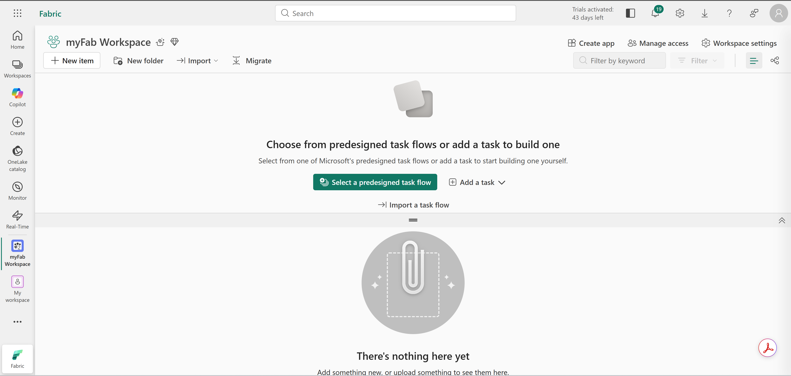
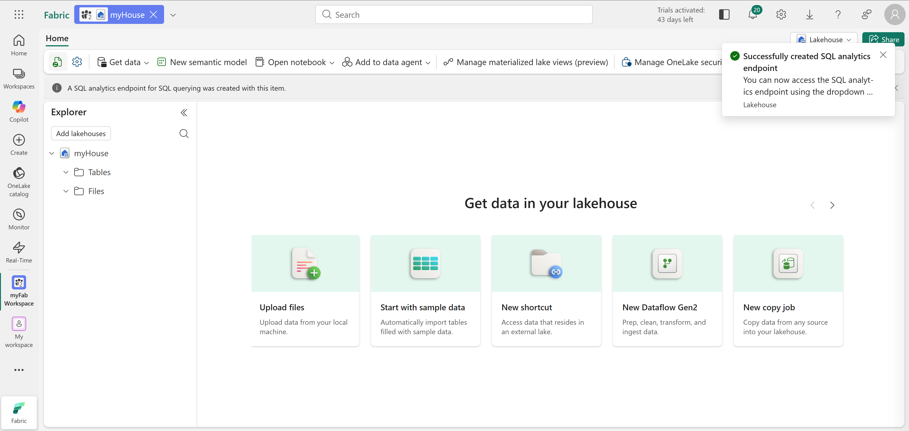
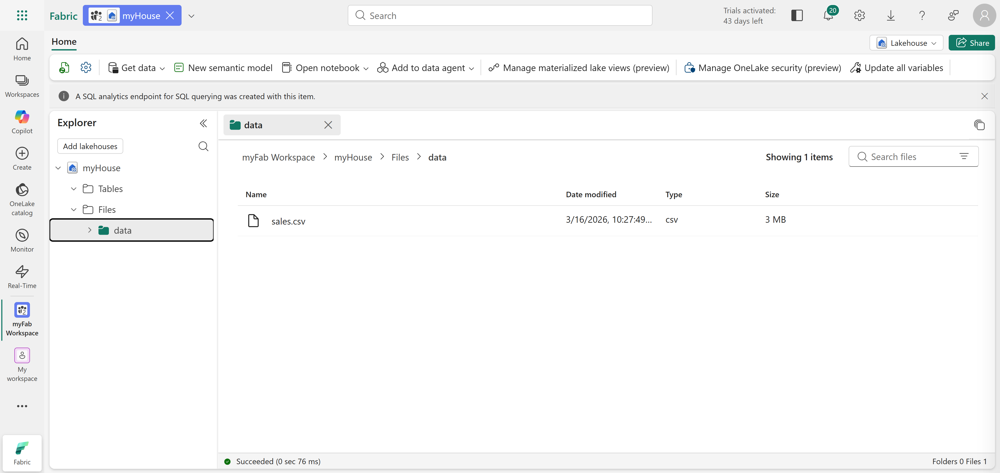
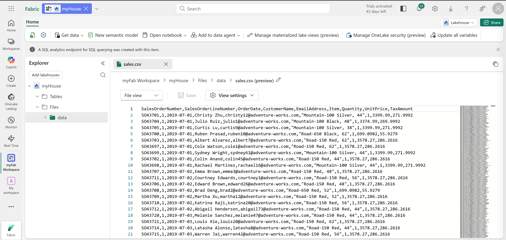
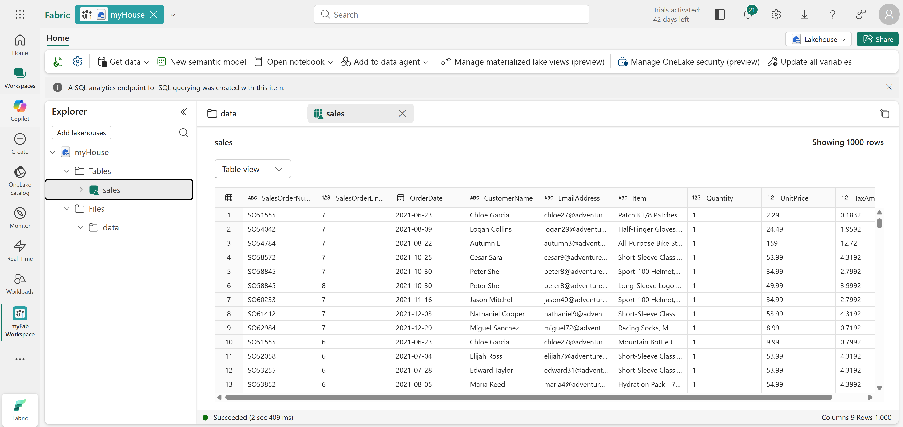
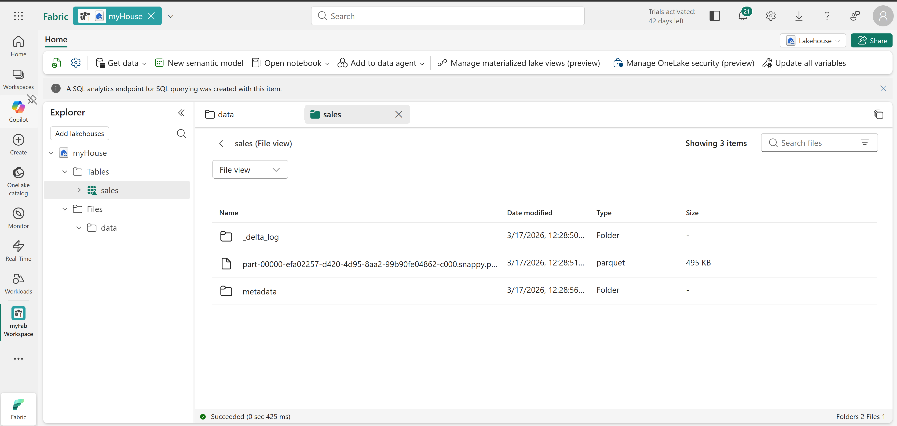
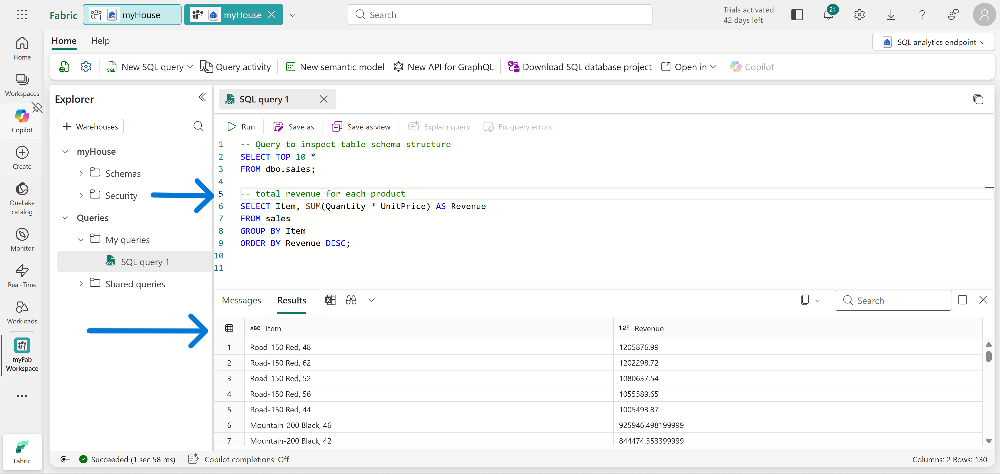
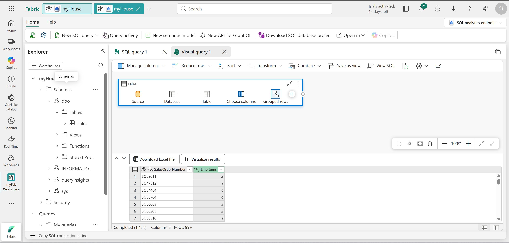

# Technical Breakdown 

## Step 1 – Create Fabric Workspace

A new workspace was created with Fabric capacity enabled.

Purpose: Provides an isolated environment for lakehouse resources.



---

## Step 2 – Create Lakehouse

A new Fabric Lakehouse was created.

Configuration: - Lakehouse schemas disabled

Purpose: Acts as a unified storage and analytics layer.



---

## Step 3 – Explore Lakehouse Structure

Two primary components were identified:

- Files → raw data storage
- Tables → structured Delta tables



---

## Step 4 – Upload Data File

Dataset: [sales.csv](https://raw.githubusercontent.com/MicrosoftLearning/dp-data/main/sales.csv)

Steps:

- Created folder: Files/data
- Uploaded CSV file into lakehouse storage

Purpose: Demonstrates direct ingestion into OneLake.

---

## Step 5 – Preview File Data

The uploaded CSV file was previewed inside Fabric.

Purpose: Validate structure and schema before transformation.



---

## Step 6 – Explore Shortcuts

Shortcut option was reviewed.

Purpose: Understand how to reference external data without duplication.

---

## Step 7 – Load File into Table

The CSV file was converted into a managed table.

Steps:

- Load to Tables → New table
- Table name: sales

Result: Delta table created in lakehouse.



---

## Step 8 – Explore Delta Table Storage

Underlying storage examined:

- Parquet files
- _delta_log transaction folder

Purpose: Understand Delta Lake architecture and transaction logging.



---

## Step 9 – Query Data Using SQL

SQL analytics endpoint used to query table.

Example:
```
SELECT Item, SUM(Quantity * UnitPrice) AS Revenue
FROM sales
GROUP BY Item
ORDER BY Revenue DESC;
```

Purpose: Generate revenue insights per product.



---

## Step 10 – Create Visual Query

Power Query interface used for no-code transformation.

Steps:

- Selected columns
- Grouped by SalesOrderNumber
- Counted line items

Purpose: Demonstrates analyst-friendly querying.



---

## Step 11 – Clean Up Resources

Workspace deleted after completing exercise.

