# Technical Breakdown

## Step 1 – Create Workspace

Fabric workspace created with capacity enabled.

---

## Step 2 – Create Lakehouse

Lakehouse named: `Sales`

---

## Step 3 – Bronze Layer (Raw Data Ingestion)

Dataset:

- 2019.csv
- 2020.csv
- 2021.csv

Steps:

- Created folder: `Files/bronze`
- Uploaded raw CSV files

Purpose: Store raw, unprocessed data.

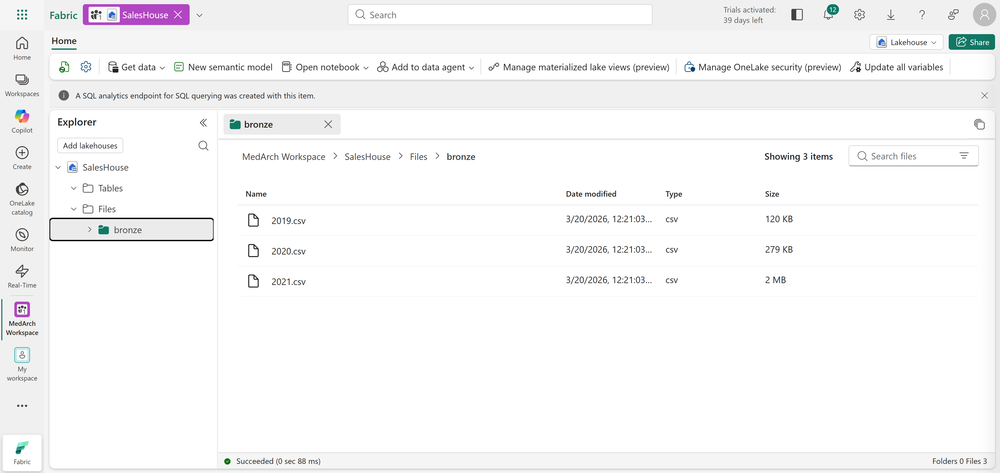

---

## Step 4 – Load Bronze Data into DataFrame

PySpark used to:

- Define schema
- Load all CSV files using wildcard

Result: Unified DataFrame from multiple files.

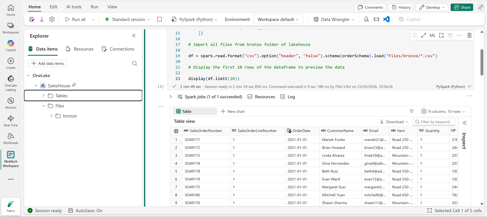

---

## Step 5 – Data Cleaning & Enrichment

Transformations applied:

- Added FileName column
- Flagged historical records (IsFlagged)
- Added CreatedTS & ModifiedTS
- Cleaned CustomerName (null → "Unknown")

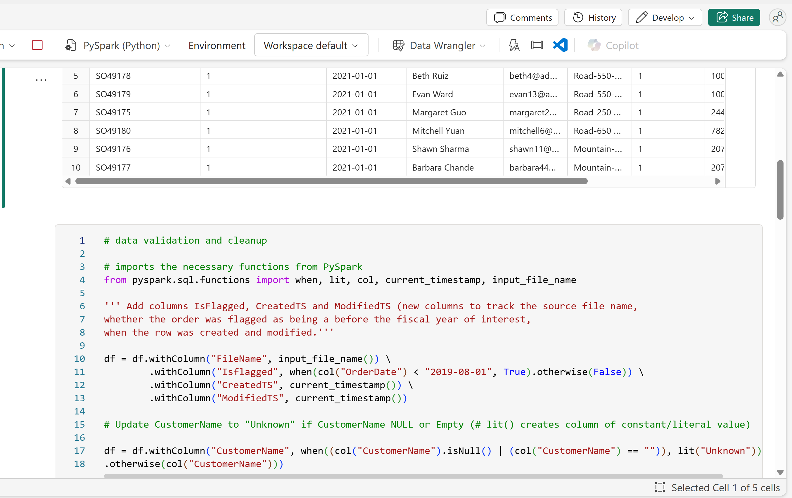

---

## Step 6 – Create Silver Delta Table

Table: `sales_silver`

Using Delta Lake schema definition.

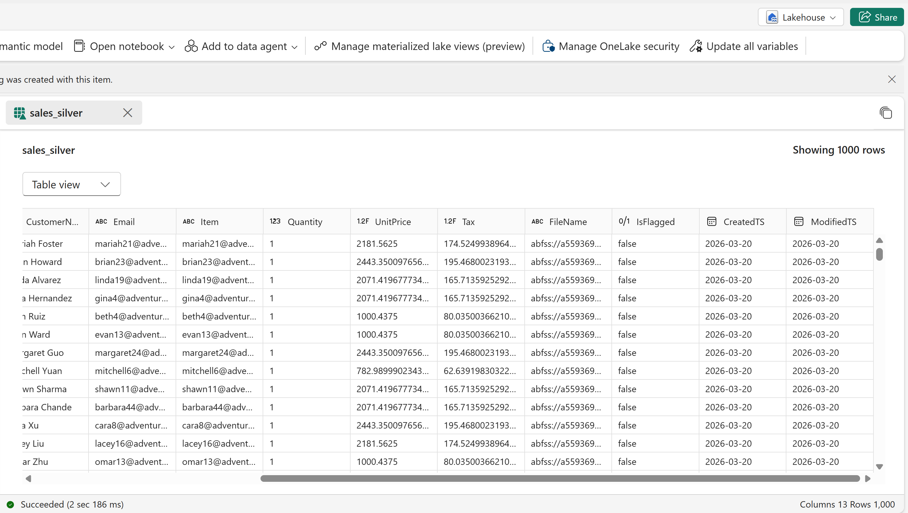

---

## Step 7 – Upsert into Silver Table

MERGE operation used:

- Match on business keys
- Insert new records
- Maintain incremental loads

Purpose: Handle evolving datasets efficiently.

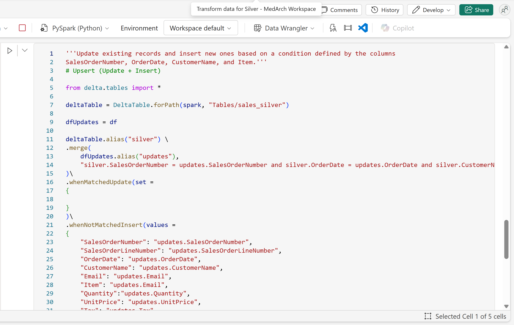

---

## Step 8 – SQL Analysis (Silver Layer)

Queries executed:

- Total sales per year
- Top customers by quantity

Purpose: Validate and explore cleaned data.

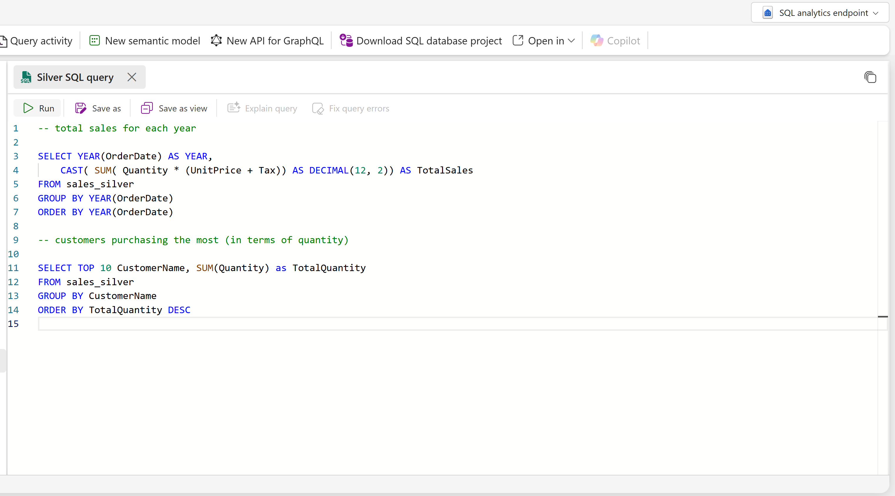

---

## Step 9 – Gold Layer Notebook

New notebook created: `Transform data for Gold`

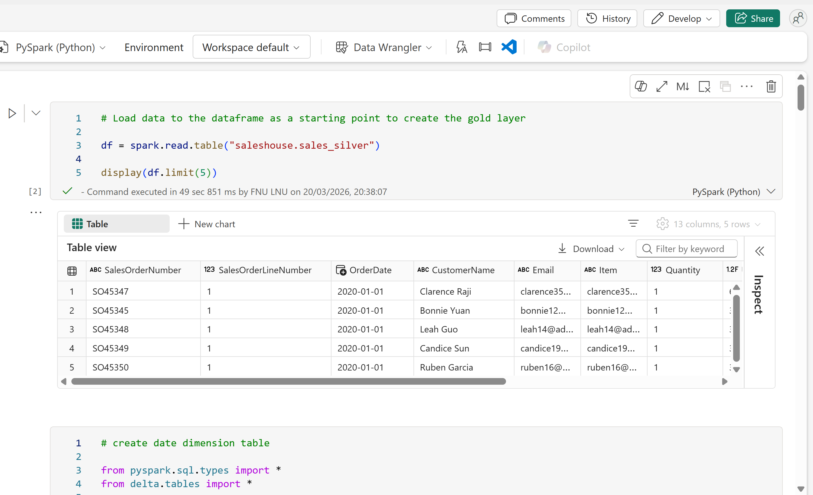

---

## Step 10 – Create Date Dimension

Table: `dimdate_gold`

Derived columns:

- Day, Month, Year
- Formatted date fields

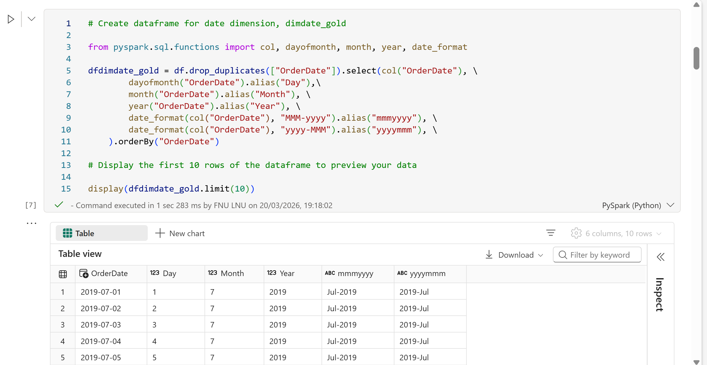

---

## Step 11 – Create Customer Dimension

Table: `dimcustomer_gold`

Transformations:

- Remove duplicates
- Split names (First, Last)
- Generate surrogate key (CustomerID)

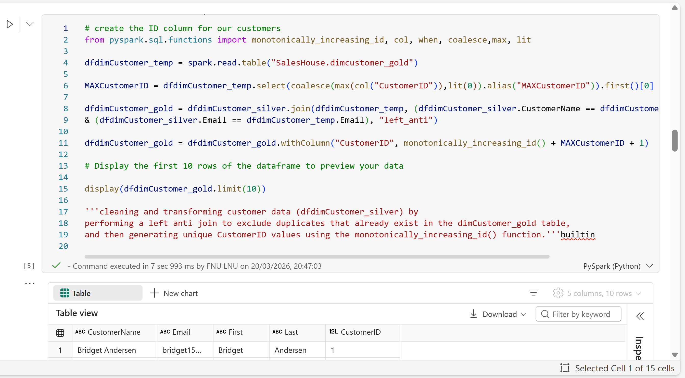

---

## Step 12 – Create Product Dimension

Table: `dimproduct_gold`

Transformations:

- Extract ItemName & ItemInfo
- Generate surrogate key (ItemID)

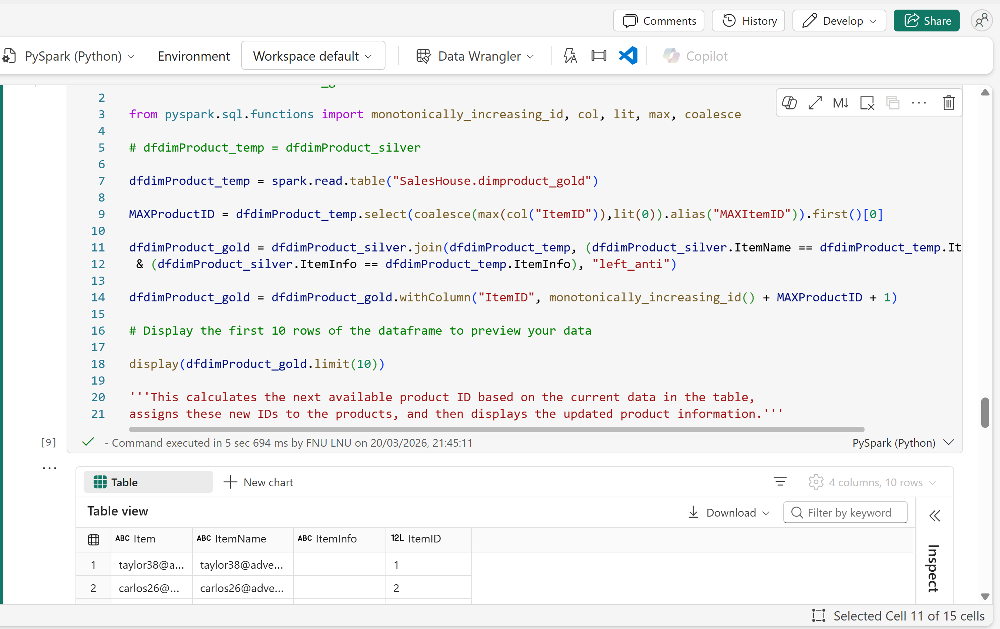

---

## Step 13 – Create Fact Table

Table: `factsales_gold`

Includes:

- CustomerID
- ItemID
- OrderDate
- Quantity
- Price & Tax

---

## Step 14 – Build Fact Table Relationships

Joins:

- Customer dimension
- Product dimension

Purpose: Create analytical dataset.

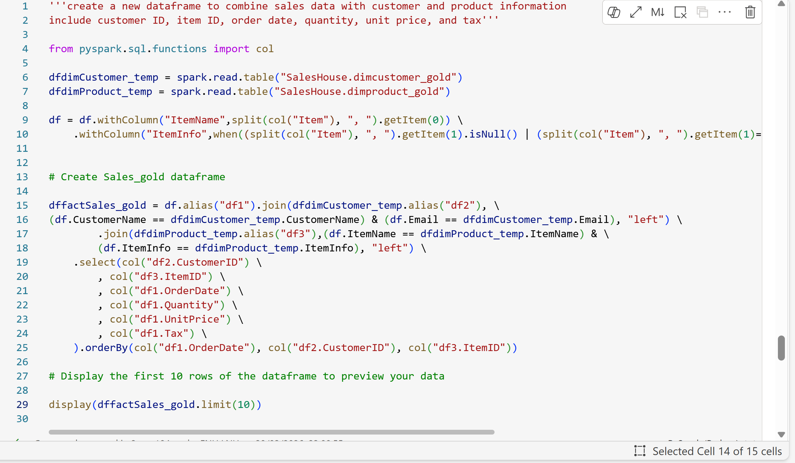

---

## Step 15 – Upsert into Fact Table

MERGE used to:

- Insert new transactions
- Maintain consistency

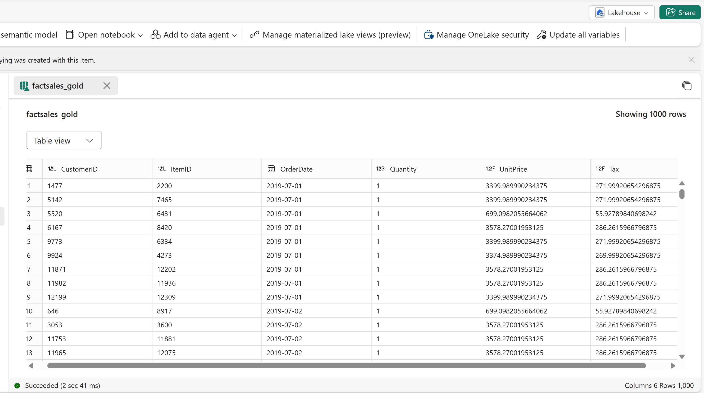

---

## Step 16 – Semantic Model

Created model: `Sales_Gold`

Tables included:

- dimdate_gold
- dimcustomer_gold
- dimproduct_gold
- factsales_gold

Purpose: Enable BI reporting.

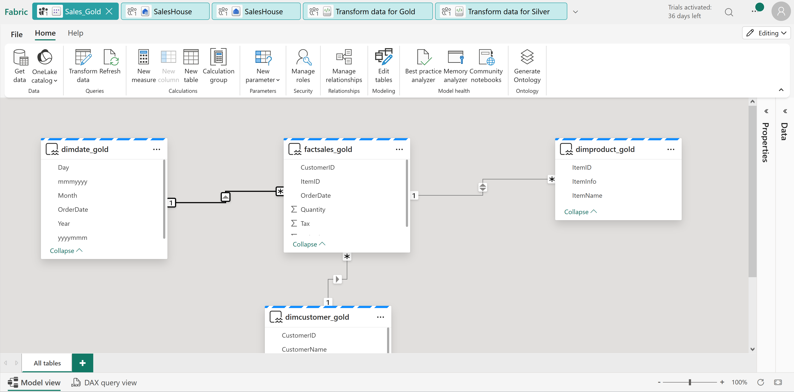

---

## Step 17 – Clean Up

Workspace deleted after completion.
