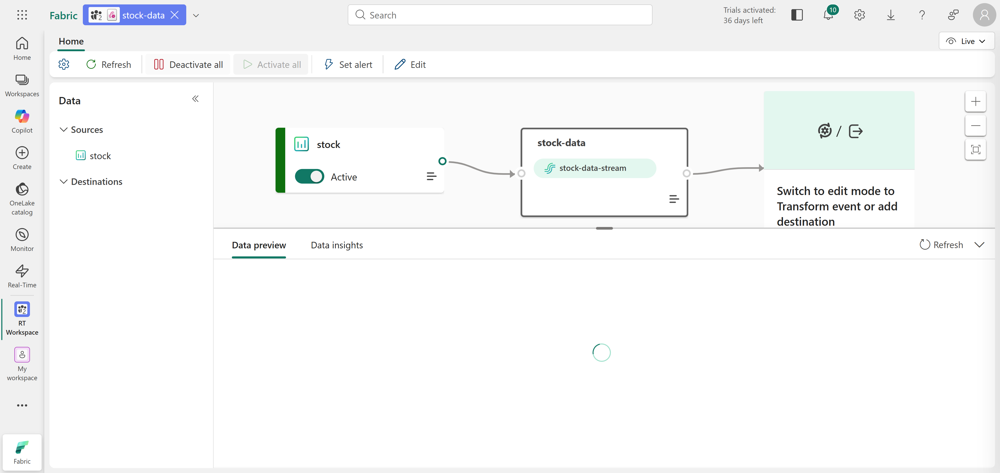
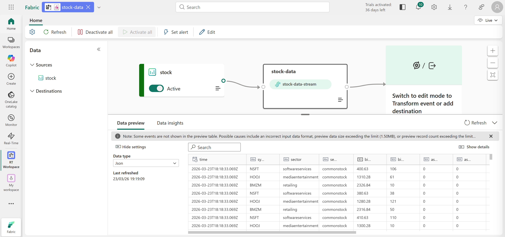
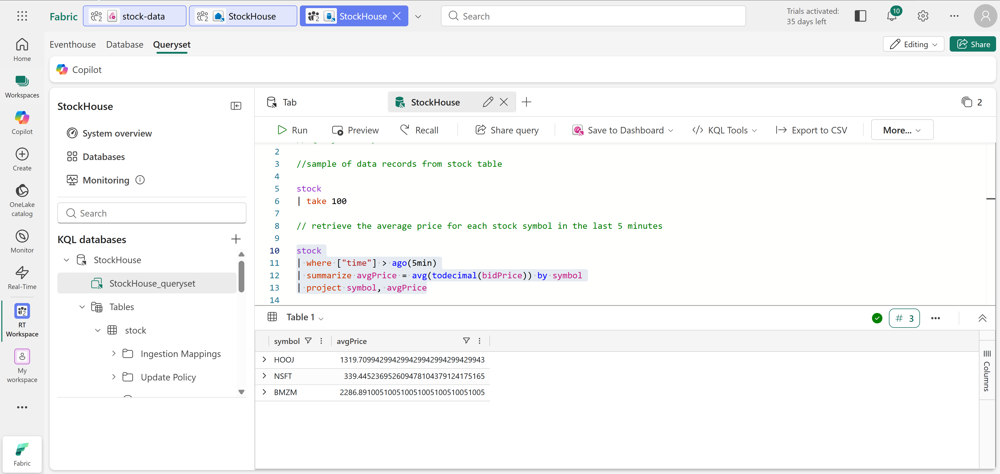
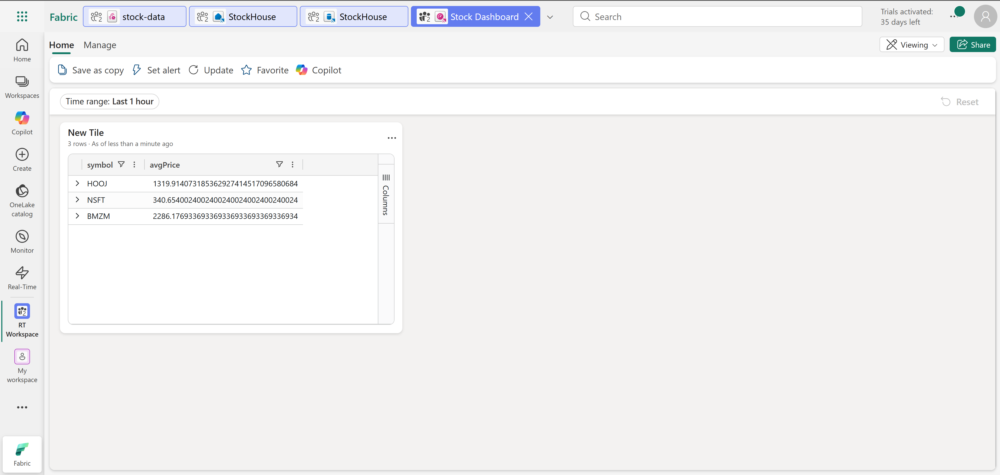
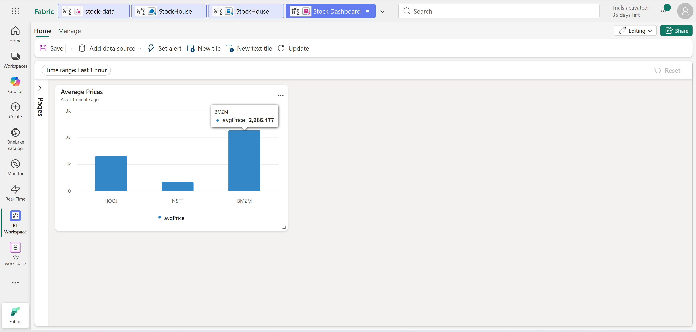
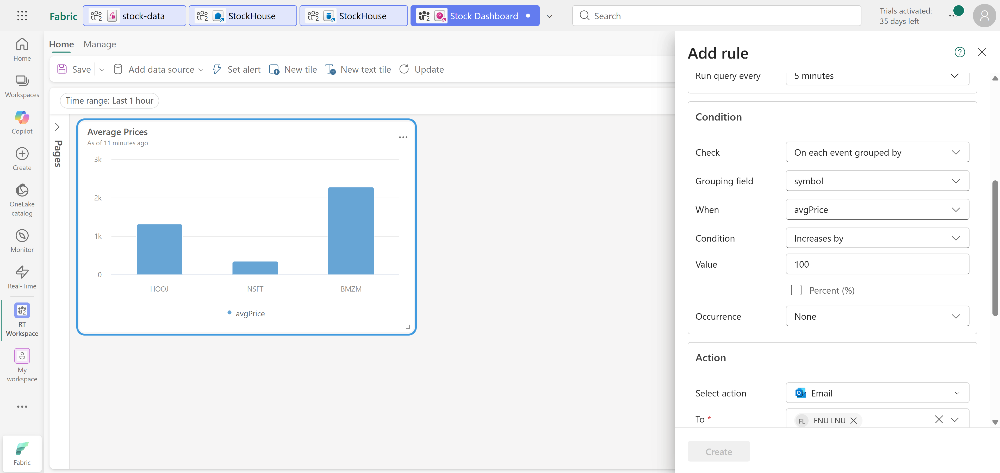
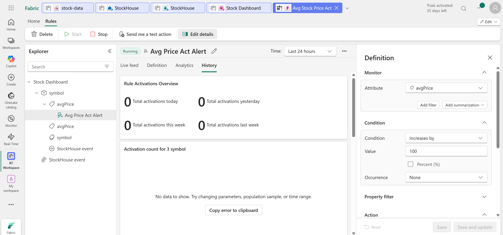

# Technical Breakdown

## Step 1 – Create Workspace

Fabric workspace created with capacity enabled.

---

## Step 2 – Create Eventstream

Source: Stock market sample data

Configuration:

- Source name: stock
- Eventstream: stock-data

Result: Real-time stream created in Fabric.



---

## Step 3 – Explore Eventstream

Components:

- Source (stock data)
- Stream output

Purpose: Visual pipeline for real-time ingestion.



---

## Step 4 – Create Eventhouse

New Eventhouse created.

Includes:

- KQL database
- Queryset for querying data

.png)

---

## Step 5 – Create Table from Stream

Table: `stock`

Steps:

- Connected Eventstream to Eventhouse
- Created destination table

Result: Streaming data persisted in KQL table.

.png)

---

## Step 6 – Validate Stream Connection

Eventstream updated with:

- Destination (Eventhouse table)

Purpose: Ensure ingestion pipeline is active.


---

## Step 7 – Query Real-Time Data

KQL Query: Retrieve latest records:
```
stock 
| take 100
````
Purpose: Preview incoming data.

---

## Step 8 – Aggregate Data

KQL Query: Average price per stock (last 5 minutes)

Result: Dynamic aggregation of streaming data.



---

## Step 9 – Create Dashboard

Dashboard: `Stock Dashboard`

Tile: Average Prices

Steps:

- Pin query to dashboard
- Convert table → column chart



---

## Step 10 – Enable Real-Time Visualization

Dashboard updated automatically as new data arrives.

Purpose: Live monitoring of stock prices.



---

## Step 11 – Create Alert (Activator)

Configuration:

- Frequency: every 5 minutes
- Condition: avgPrice increases by 100
- Grouping: symbol

Action: Send email notification



---

## Step 12 – Monitor Alert

Activator tracks:

- Trigger history
- Alert conditions



---

## Step 13 – Clean Up

Workspace deleted after completion.
