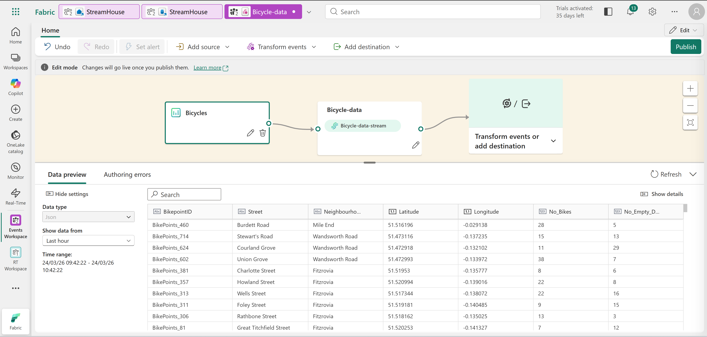
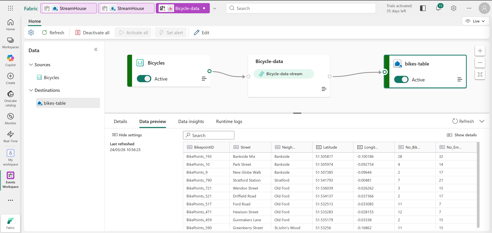
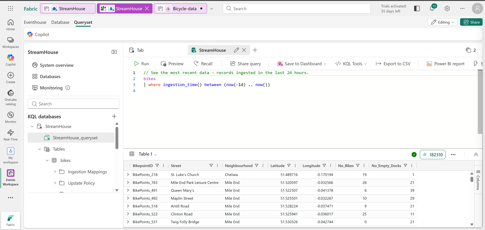
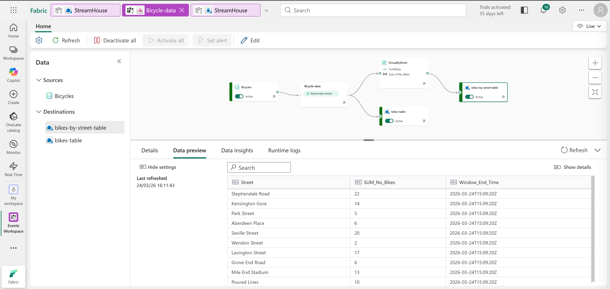
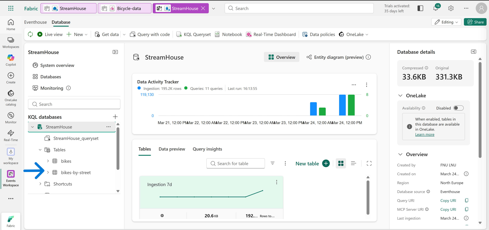
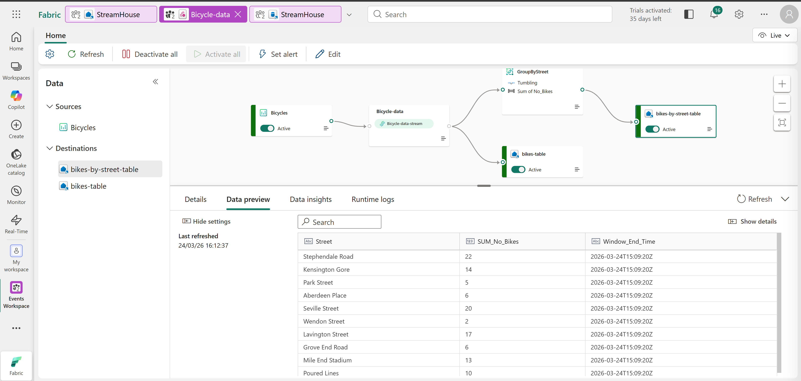
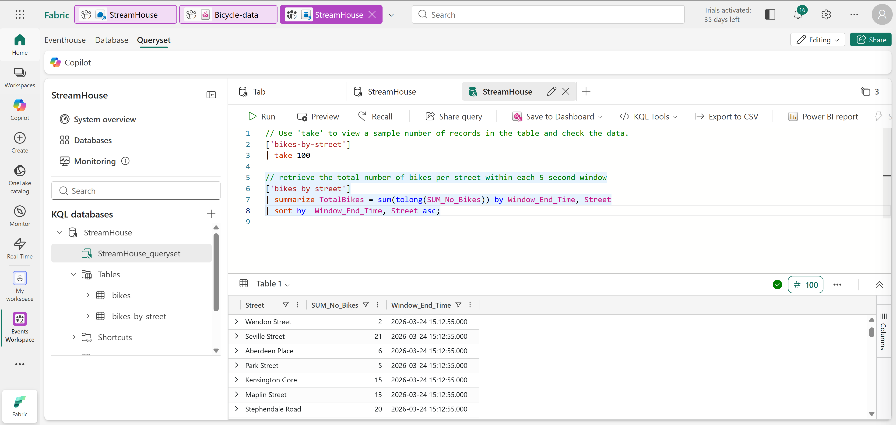

# Technical Breakdown

## Step 1 – Create Workspace

Fabric workspace created with capacity enabled.

---

## Step 2 – Create Eventhouse

Eventhouse created with:

- KQL database
- Query environment

---

## Step 3 – Create Eventstream

Eventstream: Bicycle-data

---

## Step 4 – Add Streaming Source

Source: Bicycles (sample data)

Result: Real-time event stream connected.



---

## Step 5 – Add Raw Data Destination

Destination:

- Table: bikes
- Storage: Eventhouse

Configuration:

- JSON format
- Event processing before ingestion



---

## Step 6 – Publish Eventstream

Pipeline activated.

Result: Continuous ingestion of streaming data.

---

## Step 7 – Query Raw Data

KQL Query: Retrieve last 24 hours
```
bikes  
| where ingestion_time() between (now(-1d) .. now())
```
Purpose: Validate ingestion.



---

## Step 8 – Add Transformation (Group By)

Transformation: GroupByStreet

Configuration:

- Aggregation: SUM(No_Bikes)
- Group by: Street
- Window: Tumbling (5 seconds)



---

## Step 9 – Add Aggregated Destination

New table: bikes-by-street

Stores:

- Aggregated bike counts per street
- Time window results



---

## Step 10 – Publish Updated Stream

Transformation pipeline activated.



---

## Step 11 – Query Transformed Data

KQL Query:
```
['bikes-by-street']  
| summarize TotalBikes = sum(tolong(SUM_No_Bikes)) by Window_End_Time, Street  
| sort by Window_End_Time desc
```
Purpose: Analyze aggregated real-time data.



---

## Step 12 – Clean Up

Workspace deleted after completion.
