# Technical Breakdown

## Step 1 – Create Workspace

Fabric workspace created with capacity enabled.

---

## Step 2 – Create Eventhouse

Eventhouse created with: - KQL database

---

## Step 3 – Create Eventstream

Eventstream: `Bicycle-data`

Source: - Bicycles sample dataset

---

## Step 4 – Add Destination Table

Table: `bikes`

Configuration:

- JSON format
- Event processing before ingestion

---

## Step 5 – Publish Eventstream

Streaming ingestion activated.

---

## Step 6 – Create Real-Time Dashboard

Dashboard: `bikes-dashboard`

Data source: - Eventhouse (KQL database)

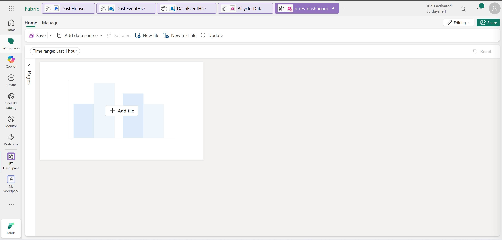

---

## Step 7 – Create First Visual (Bar Chart)

Query: - Bikes vs empty docks per neighbourhood

Visualization: - Stacked bar chart

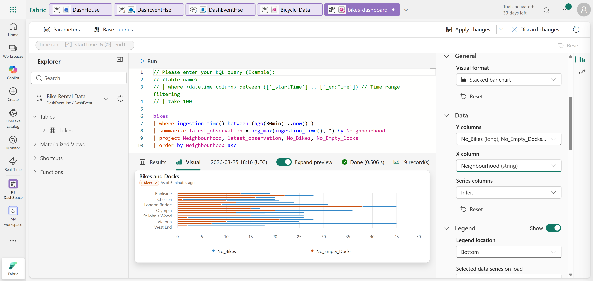
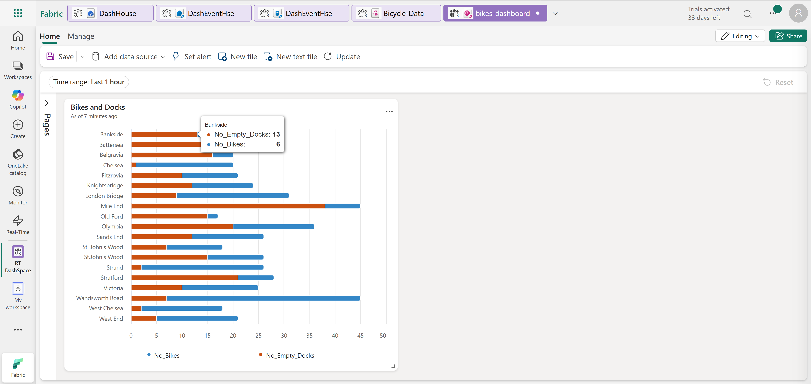

---

## Step 8 – Create Second Visual (Map)

Query: - Bike locations with coordinates

Visualization: - Map with size-based markers

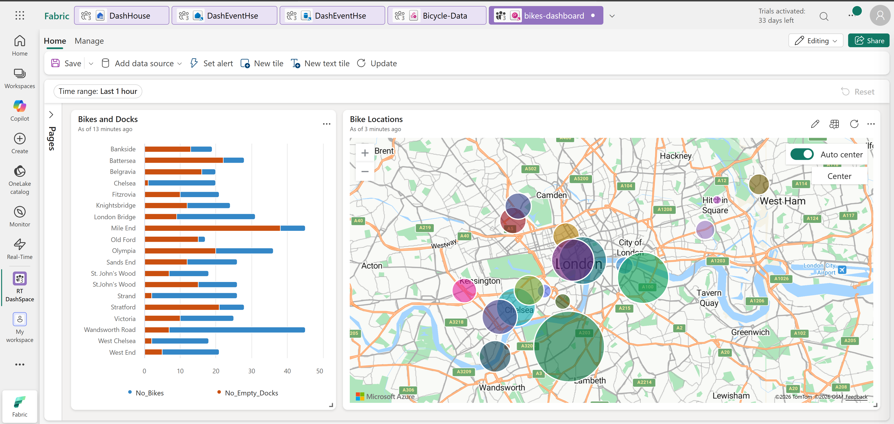

---

## Step 9 – Create Base Query

Base query:  `base_bike_data`

Purpose:

- Centralize shared logic
- Avoid duplication across visuals

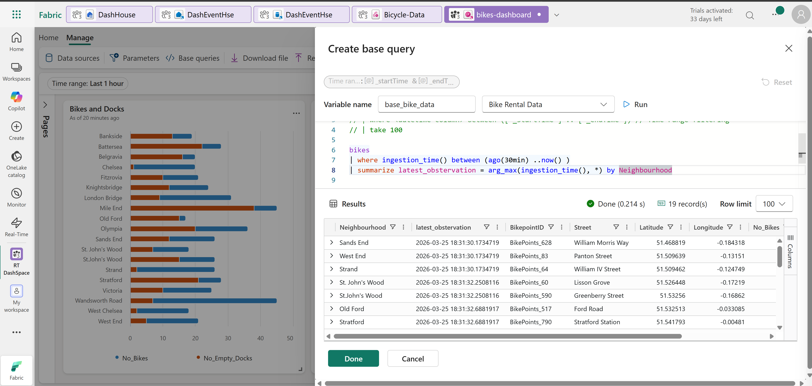

---

## Step 10 – Refactor Visual Queries

Both visuals updated to use: `base_bike_data`

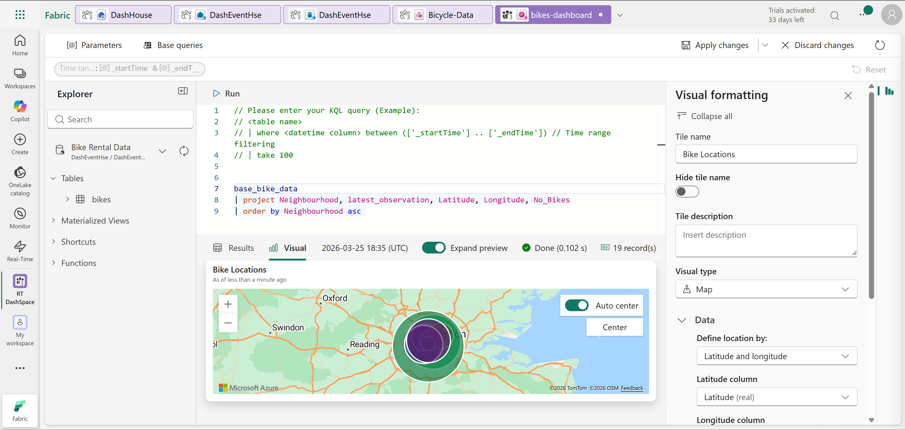

---

## Step 11 – Add Parameter

Parameter: `selected_neighbourhoods`

Features:

- Multi-select filter
- Dynamic query filtering

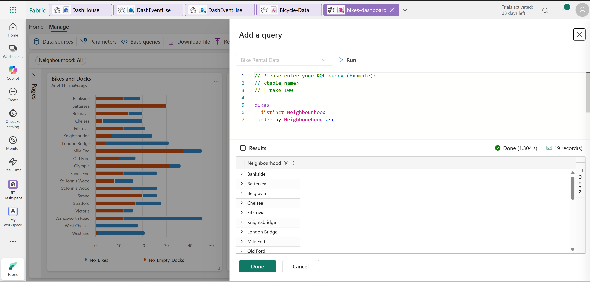
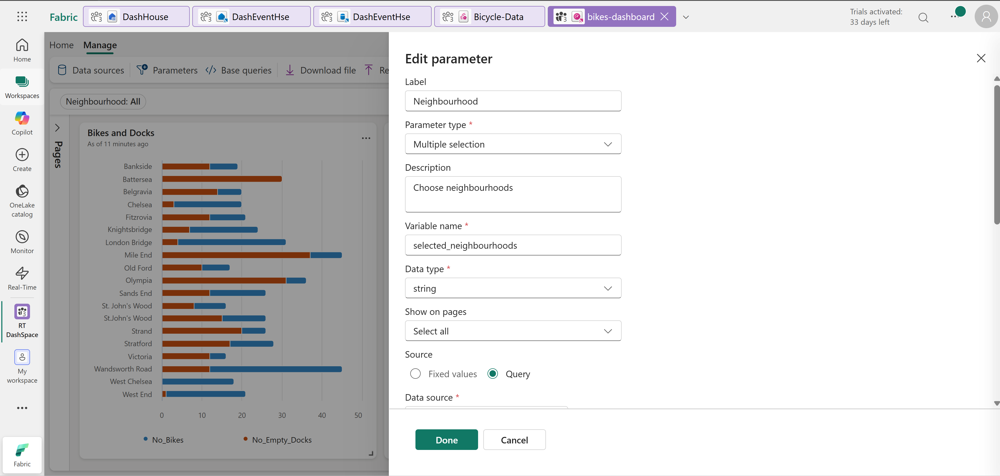

---

## Step 12 – Update Base Query with Filter

Condition added: `- Filter by selected neighbourhoods`

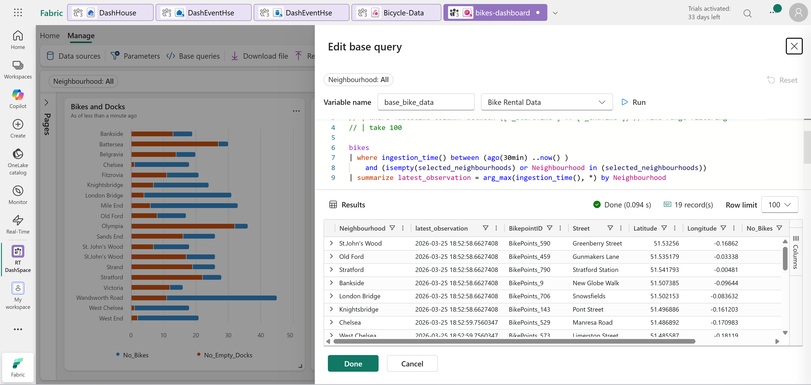

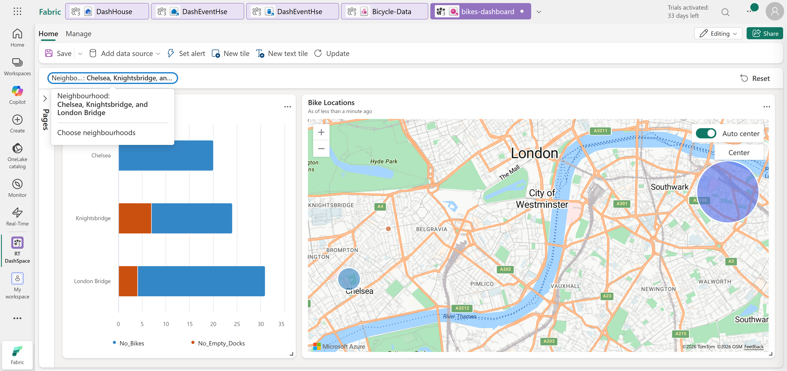

---

## Step 13 – Add Dashboard Page

New page: `Page 2`

Purpose: - Display latest observations

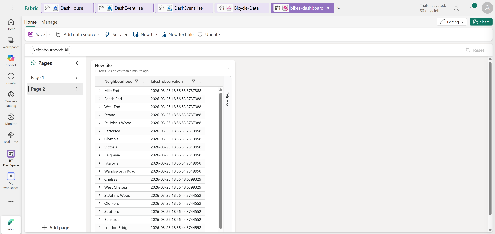

---

## Step 14 – Configure Auto Refresh

Settings:

- Enabled
- Default refresh: 30 minutes

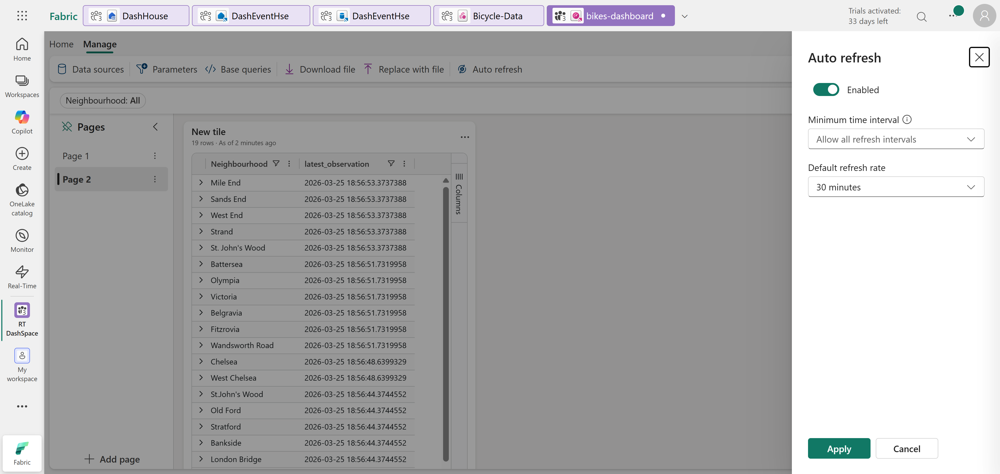

---

## Step 15 – Save and Share Dashboard

- Dashboard saved
- Shareable link generated

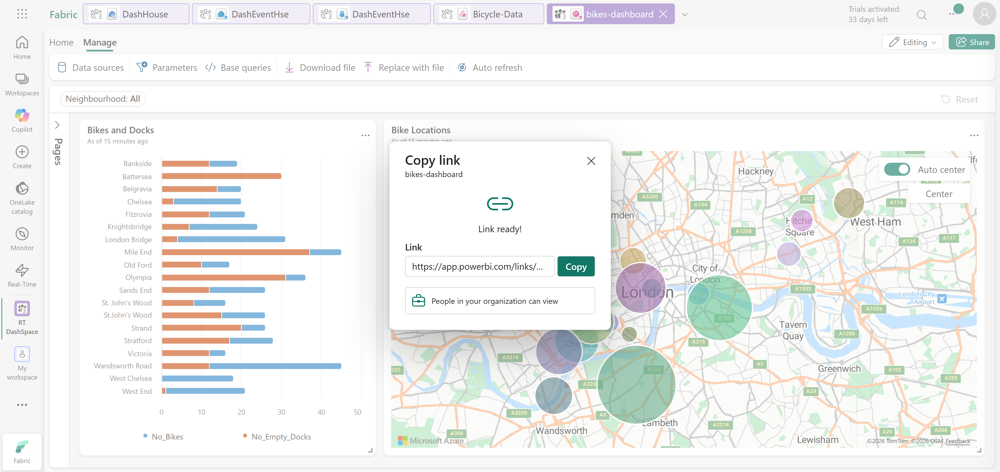

---

## Step 16 – Clean Up

Workspace deleted after completion.
