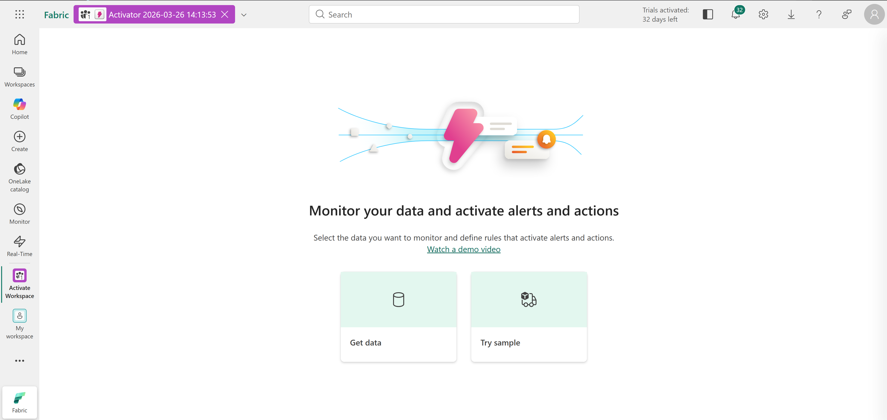
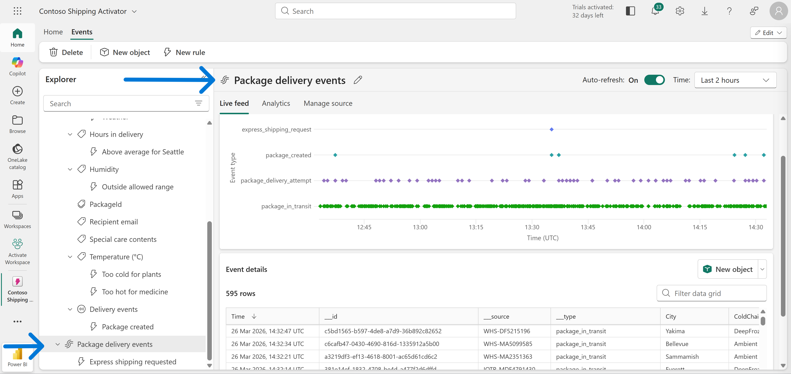
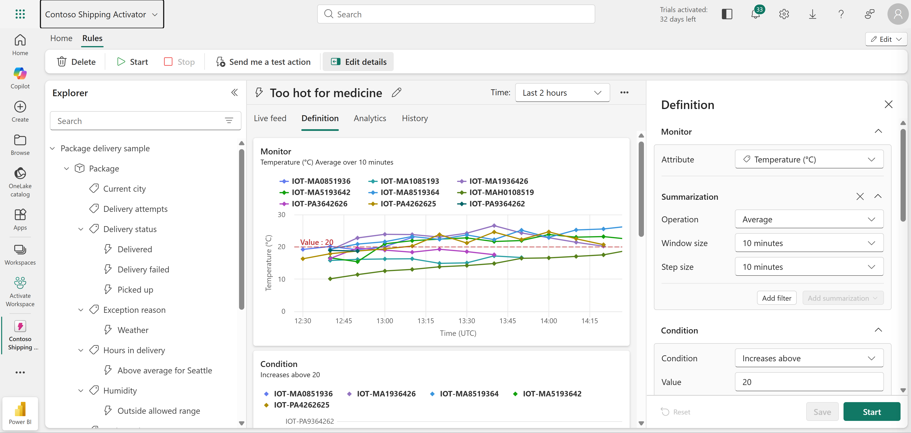
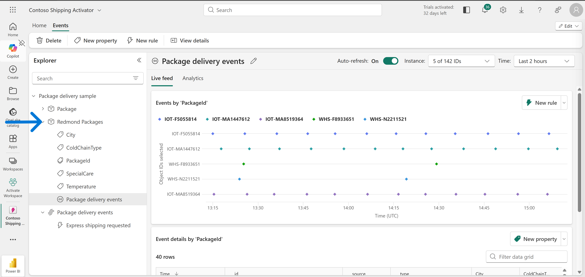
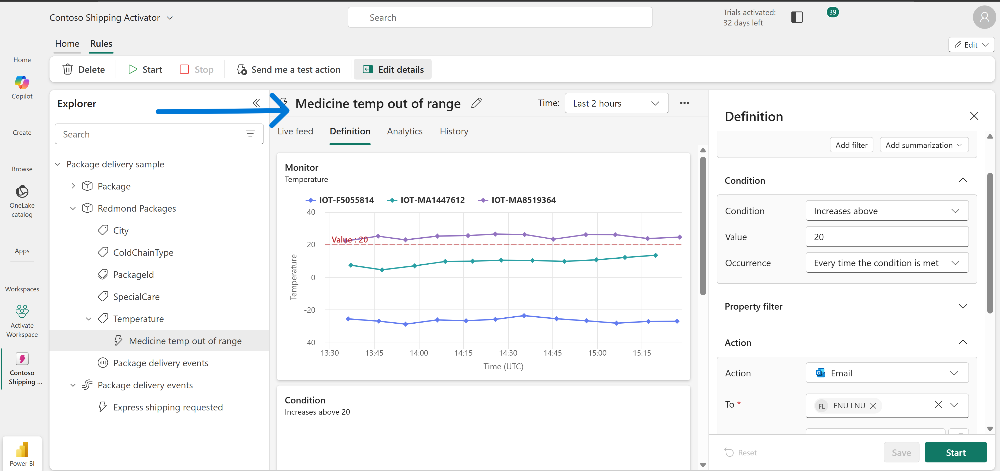
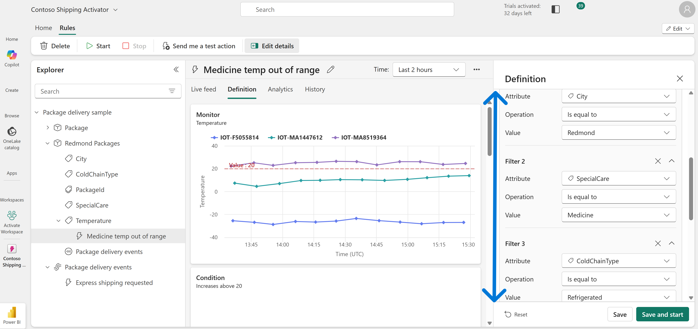
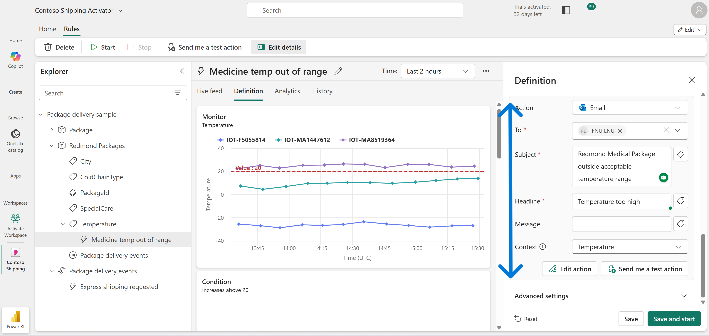
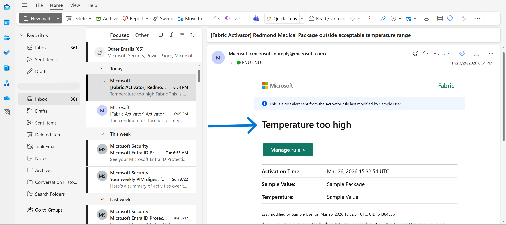

# Technical Breakdown

## Step 1 – Create Workspace

Fabric workspace created with capacity enabled.

---

## Step 2 – Create Activator

Activator created using: - Sample dataset (Package delivery events)

---

## Step 3 – Explore Event Stream

Reviewed incoming real-time data:

- PackageId
- Temperature
- City
- SpecialCare
- ColdChainType

---

## Step 4 – Review Existing Rule

Analyzed built-in rule: `Too hot for medicine`

Logic:

- Temperature > 20°C
- Filter: Medicine only
- Action: Alert

---

## Step 5 – Create Custom Object

Object created: `Redmond Packages`

Configuration:

- Unique identifier: PackageId
- Properties:
  - City
  - SpecialCare
  - ColdChainType
  - Temperature
 

---

## Step 6 – Create Alert Rule

Rule: `Medicine temp out of range`

Condition: - Temperature increases above 20°C

Occurrence: - Every event

---

## Step 7 – Apply Filters

Filters added:

- City = Redmond
- SpecialCare = Medicine
- ColdChainType = Refrigerated

---

## Step 8 – Configure Alert Action

Action: - Send Email

Configuration:

- Subject: Temperature alert
- Context: Temperature value included

---

## Step 9 – Activate Rule

Rule started and monitored:

- Real-time triggers observed
- Alerts generated dynamically

---

## Step 10 – Clean Up

Workspace deleted after completion.
