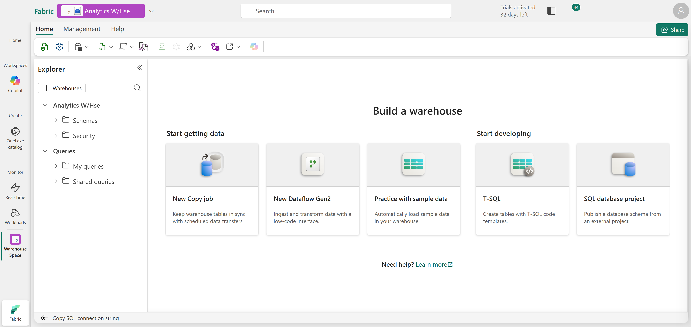
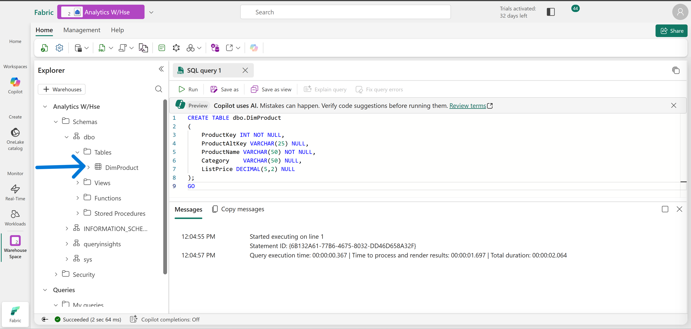
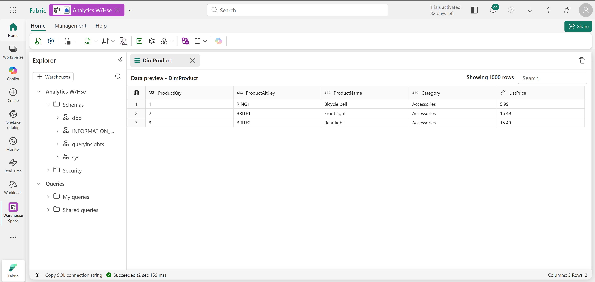
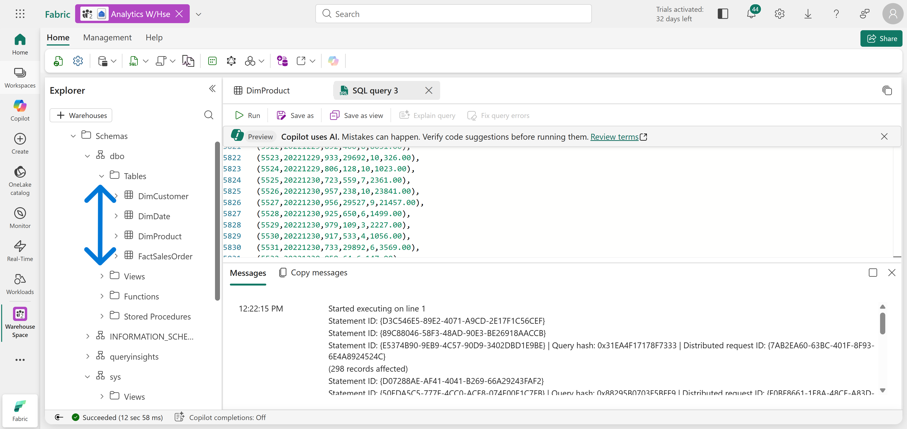
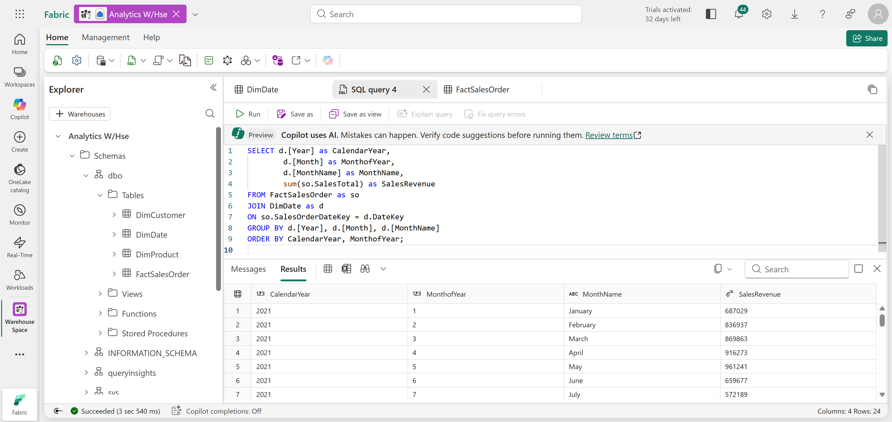
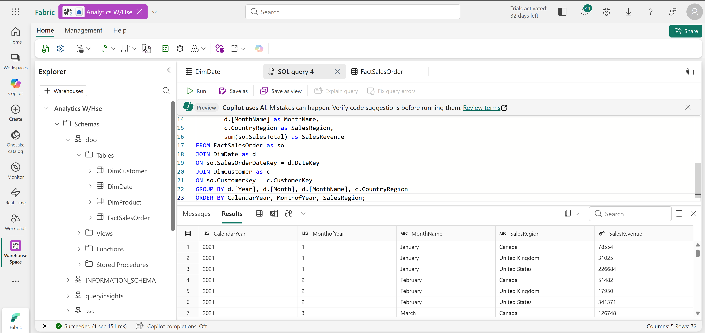
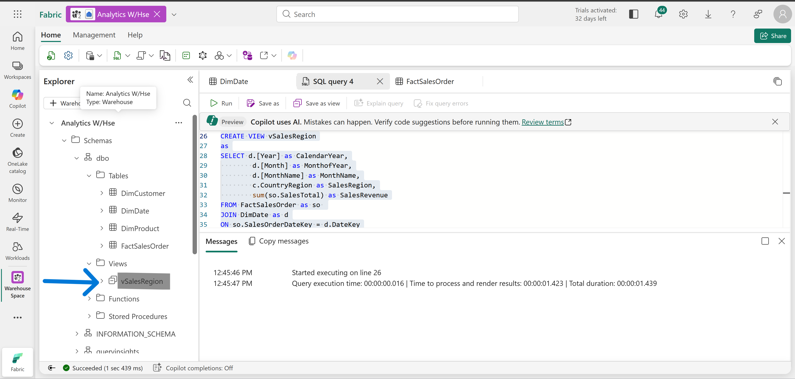
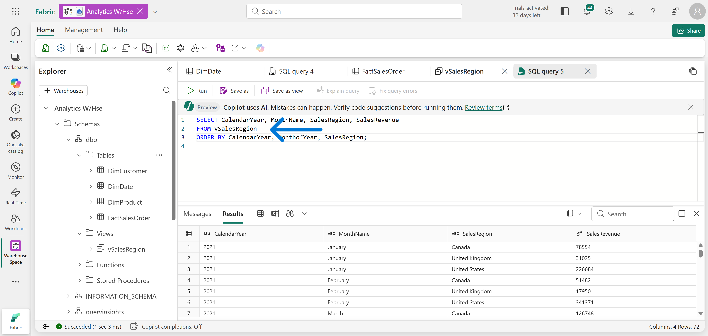
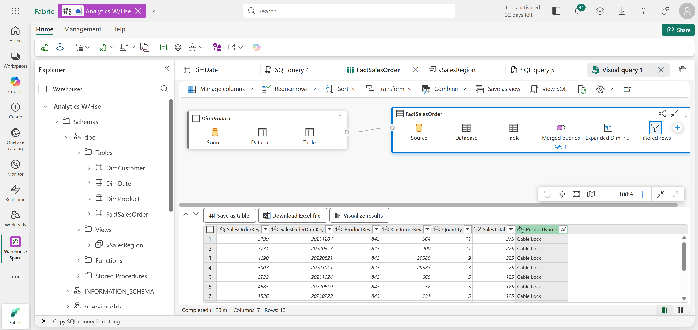
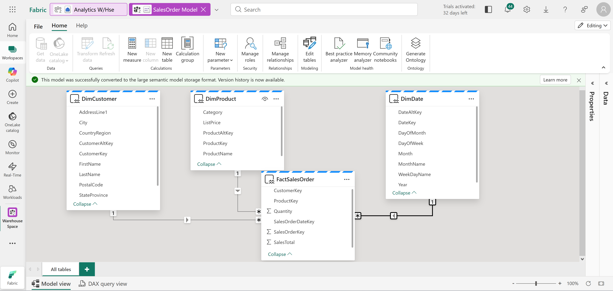

# Technical Breakdown

## Step 1 – Create Workspace

Fabric workspace created with capacity enabled.

---

## Step 2 – Create Data Warehouse

Warehouse created with:

- Full SQL support
- Relational engine

---

## Step 3 – Create Table (DimProduct)

Table: `DimProduct`

Columns:

- ProductKey
- ProductAltKey
- ProductName
- Category
- ListPrice

---

## Step 4 – Insert Data

Inserted sample product records using: `INSERT INTO` statement

---

## Step 5 – Load Full Schema

Executed SQL script to create:

- DimCustomer
- DimDate
- DimProduct
- FactSalesOrder

---

## Step 6 – Query Fact + Dimension Tables

Query: - Joined FactSalesOrder with DimDate

Result: - Sales aggregated by Year and Month

---

## Step 7 – Multi-Dimensional Query

Extended query: - Joined DimCustomer

Result: - Sales by Year, Month, Region

---

## Step 8 – Create View

View: `vSalesByRegion`

Purpose:

- Encapsulate aggregation logic
- Reuse query logic

---

## Step 9 – Query View

Used: SELECT FROM vSalesByRegion

---

## Step 10 – Visual Query

Used drag-and-drop interface:

- Joined FactSalesOrder + DimProduct
- Expanded ProductName
- Applied filter (Cable Lock)

---

## Step 11 – Semantic Model

Created relationships:

- Fact → Product
- Fact → Customer
- Fact → Date

Schema: - Star schema design

---

## Step 12 – Clean Up

Workspace deleted after completion.
