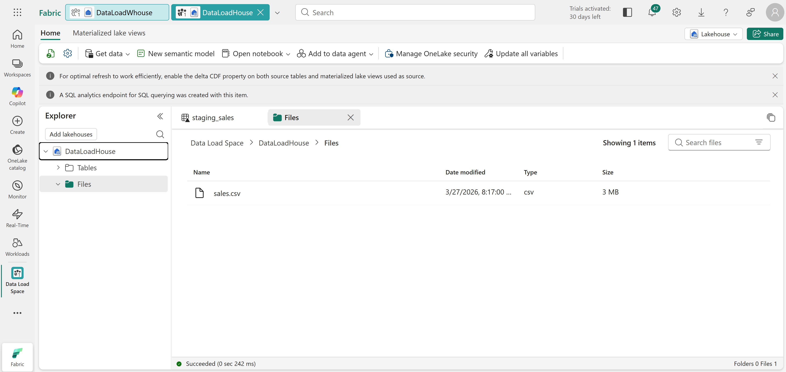
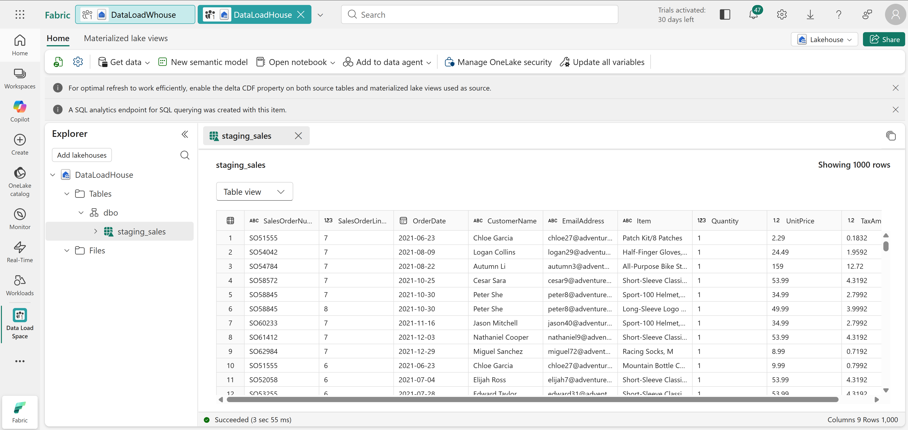
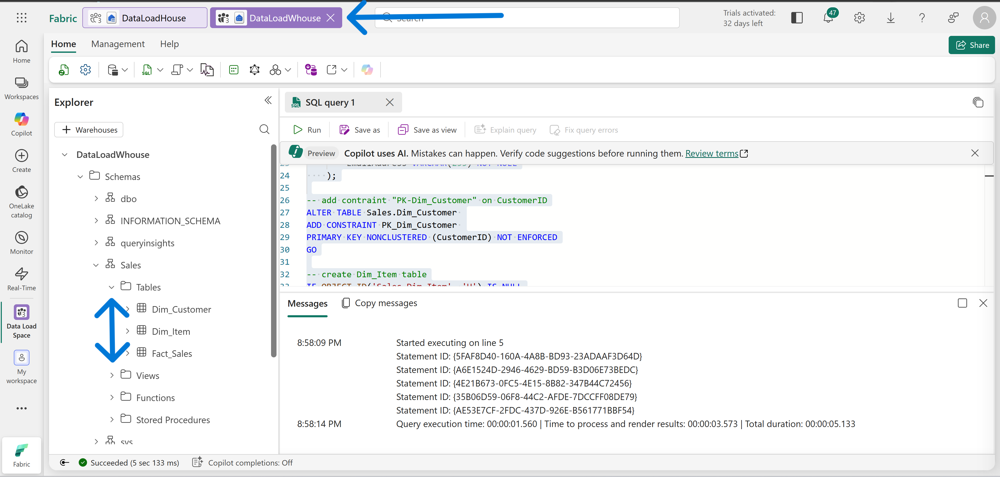
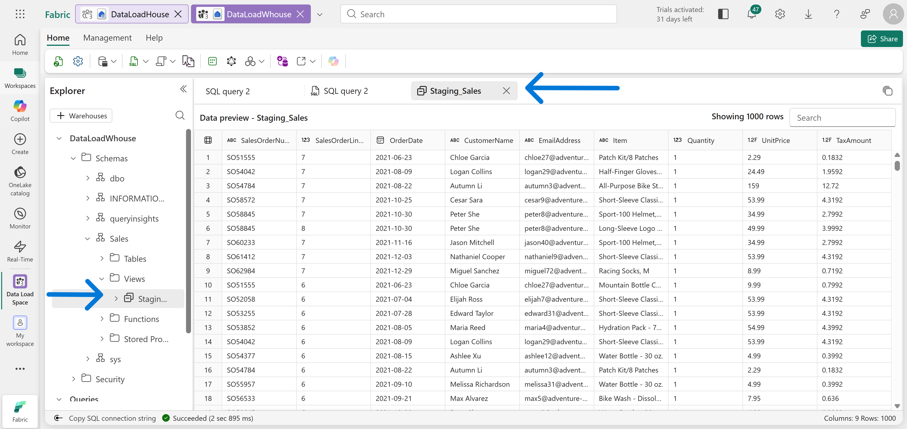
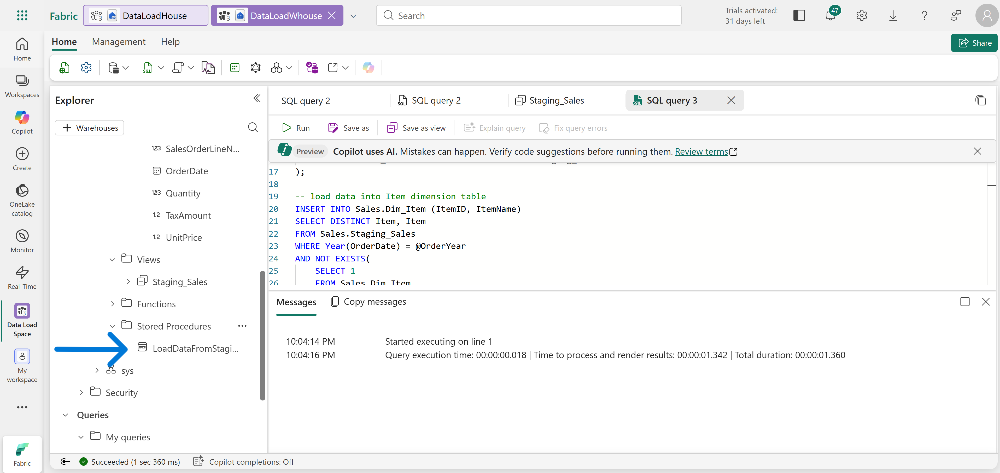
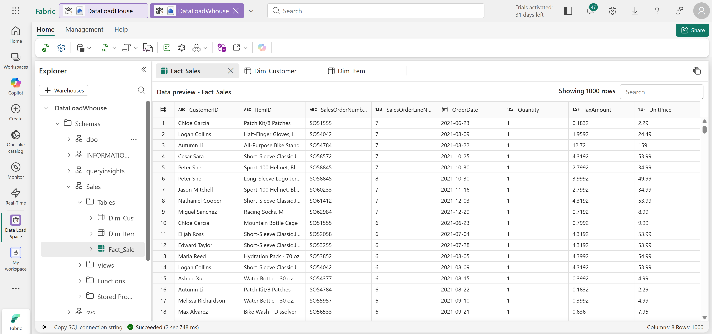
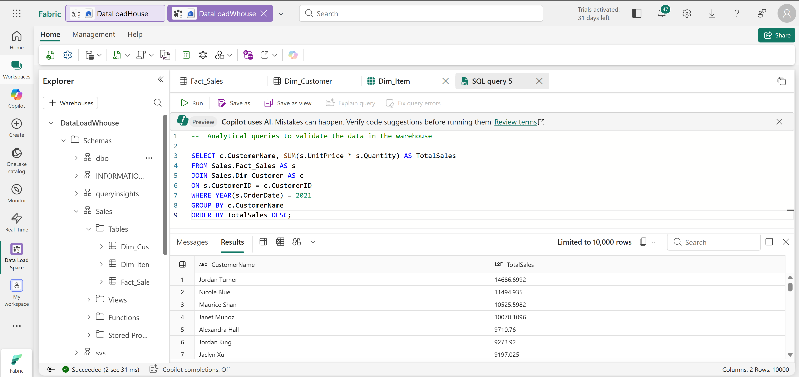
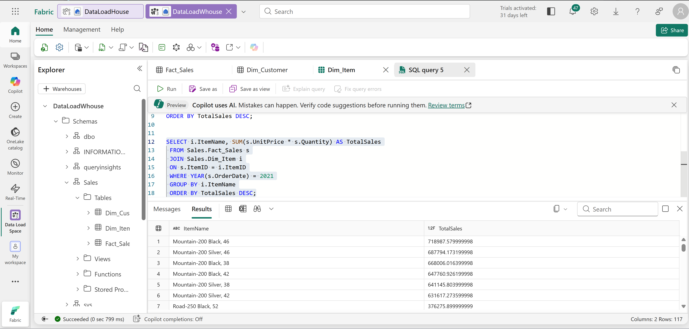
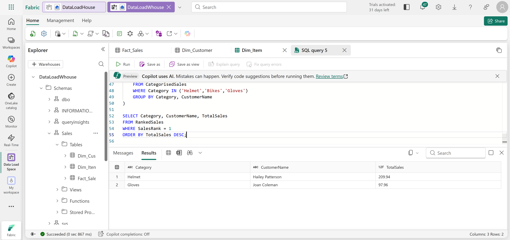

# Technical Breakdown

## Step 1 – Create Workspace

Fabric workspace created with capacity enabled.

---

## Step 2 – Create Lakehouse

Lakehouse created for staging raw data.

---

## Step 3 – Upload CSV File

File: [sales.csv](https://github.com/MicrosoftLearning/dp-data/raw/main/sales.csv)

Uploaded to: Files section of lakehouse

---

## Step 4 – Create Staging Table

Table: `staging_sales`

Method:

- Loaded from CSV
- Header enabled

---

## Step 5 – Create Data Warehouse

Warehouse created with full SQL capabilities.

---

## Step 6 – Create Schema and Tables

Schema: `Sales`

Tables:

- Fact_Sales
- Dim_Customer
- Dim_Item

---

## Step 7 – Create Staging View

View: `Sales.Staging_Sales`

Purpose:

- Access lakehouse data from warehouse
- Simplify ETL logic

---

## Step 8 – Create Stored Procedure

Procedure: `Sales.LoadDataFromStaging`

Logic:

- Load customers (deduplicated)
- Load items (deduplicated)
- Load fact sales

---

## Step 9 – Execute ETL Process

Command: `EXEC Sales.LoadDataFromStaging 2021`

Result: - Data loaded into warehouse tables

---

## Step 10 – Analytical Query (Customers)

- Total sales per customer
- Sorted descending

---

## Step 11 – Analytical Query (Products)

- Total sales per item
- Identifies top-selling products

---

## Step 12 – Advanced Query (Categorisation)

- Categorized items (Bike, Helmet, Gloves)
- Ranked customers per category
- Used ROW_NUMBER()

---

## Step 13 – Clean Up

Workspace deleted after completion.
