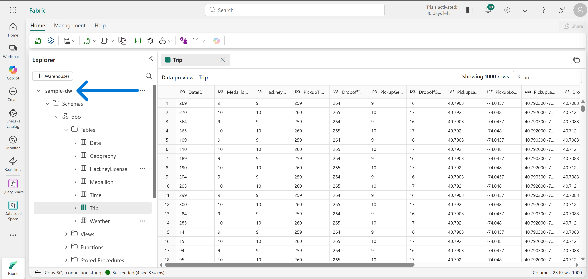
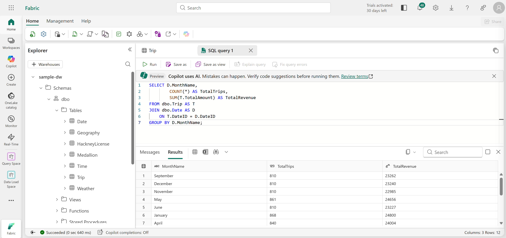
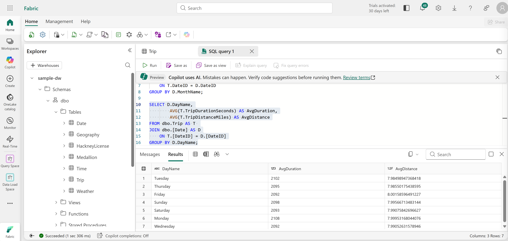
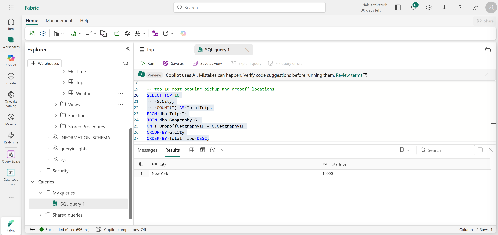
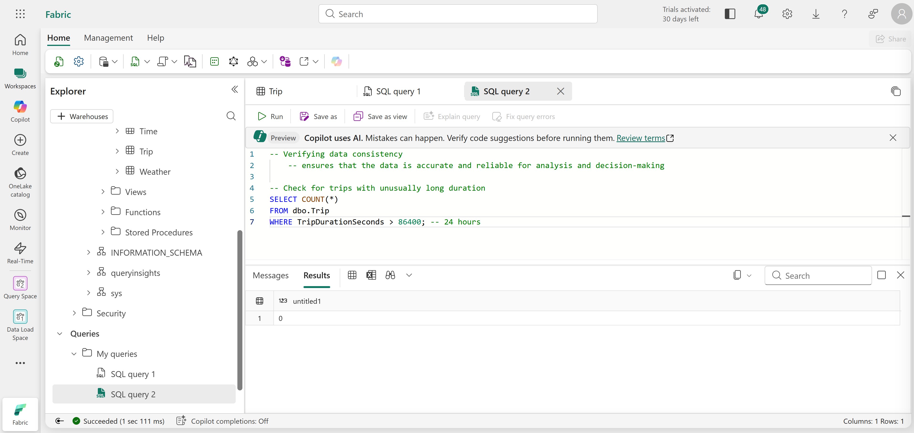
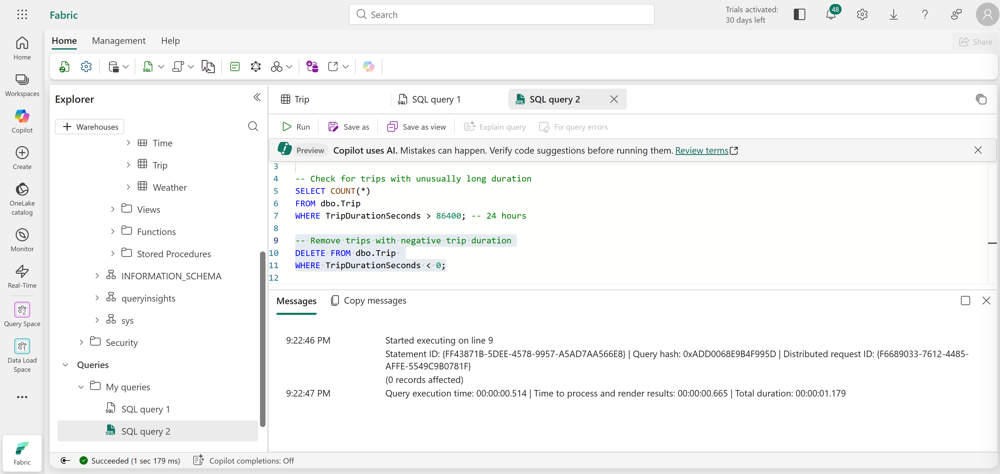
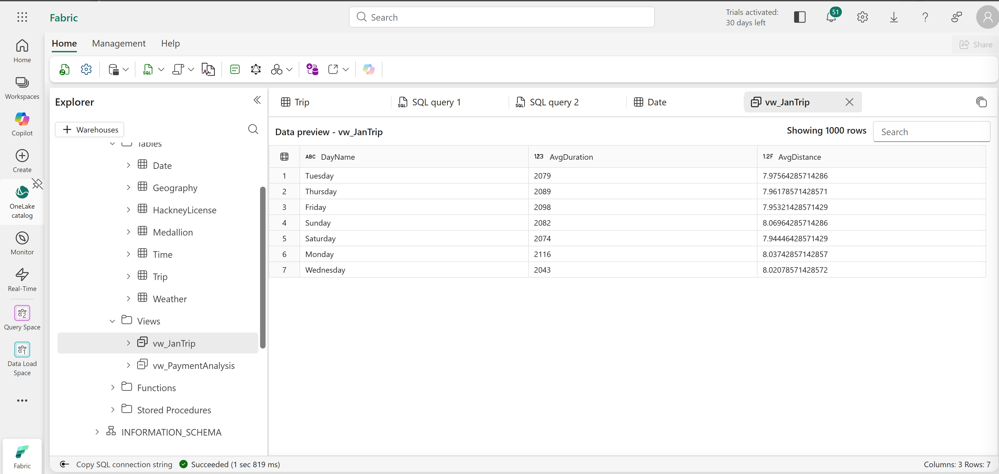
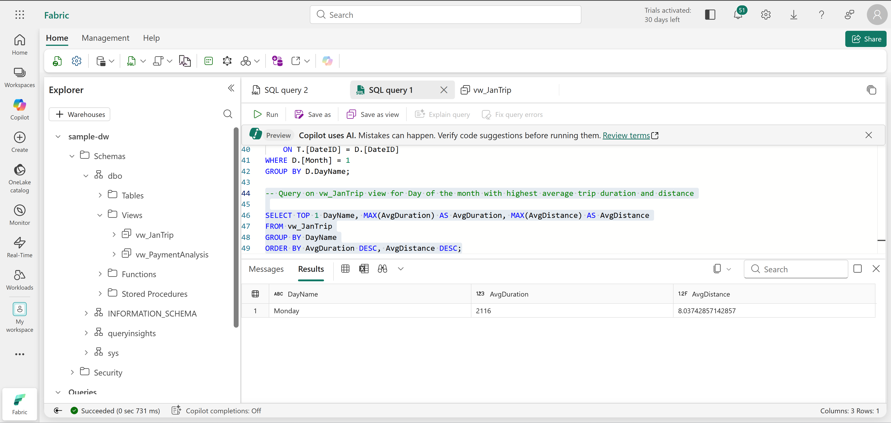

# Technical Breakdown

## Step 1 – Create Workspace

- Fabric workspace created with capacity enabled

---

## Step 2 – Create Sample Data Warehouse

Warehouse: `sample-dw`

- Preloaded with taxi trip dataset



---

## Step 3 – Query Aggregated Data

### Query 1 – Trips & Revenue by Month

- Joined Trip and Date tables
- Aggregated:
  - Total trips
  - Total revenue



---

### Query 2 – Average Trip Metrics

- Calculated:
  - Average trip duration
  - Average trip distance
- Grouped by day of week



---

### Query 3 – Top Locations

- Identified top 10 cities by trip volume
- Joined Trip and Geography tables



---

## Step 4 – Verify Data Consistency

### Check 1 – Long Trips

- Identified trips longer than 24 hours



---

### Check 2 – Negative Durations

- Detected invalid negative values



---

## Step 5 – Data Cleansing

- Removed invalid records:
```
DELETE FROM dbo.Trip  
WHERE TripDurationSeconds < 0
```
---

## Step 6 – Create View

View: `vw_JanTrip`

Purpose:

- Filter trips for January
- Simplify reporting queries



---

## Step 7 – Save & Validate View

- View stored in dbo schema
- Queried for reporting use
    - Day of Week with highest Average Duration & Distance



---

## Step 8 – Clean Up

- Workspace deleted after completion
