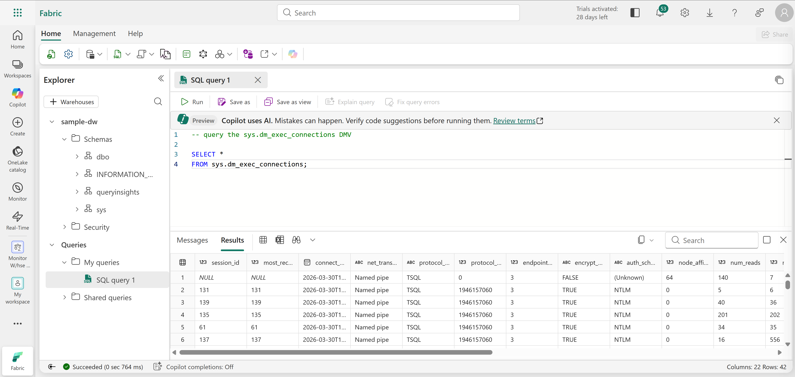
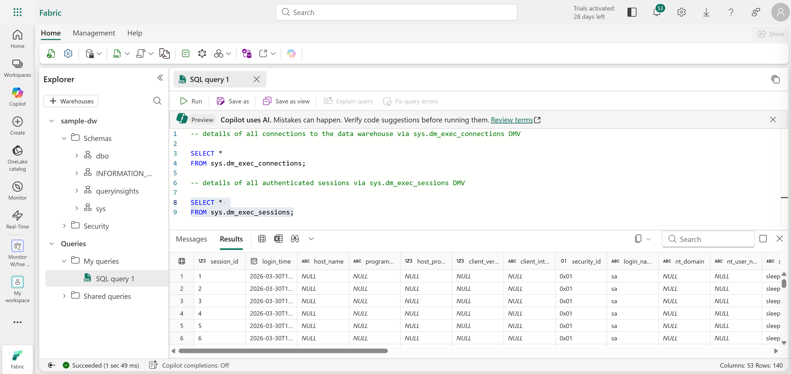
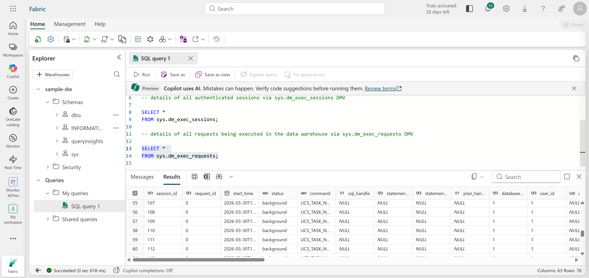
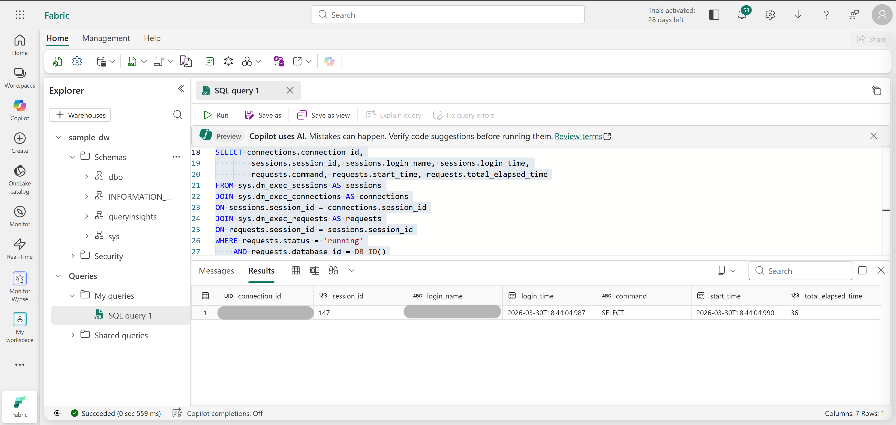
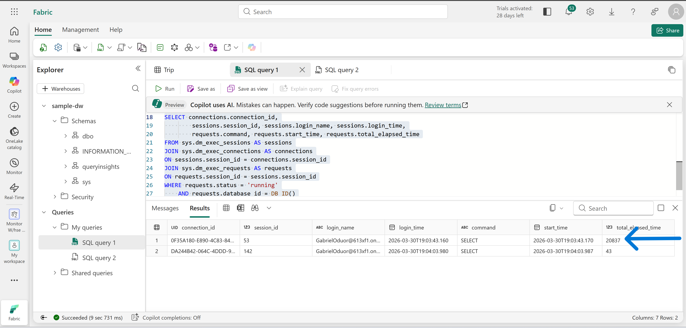
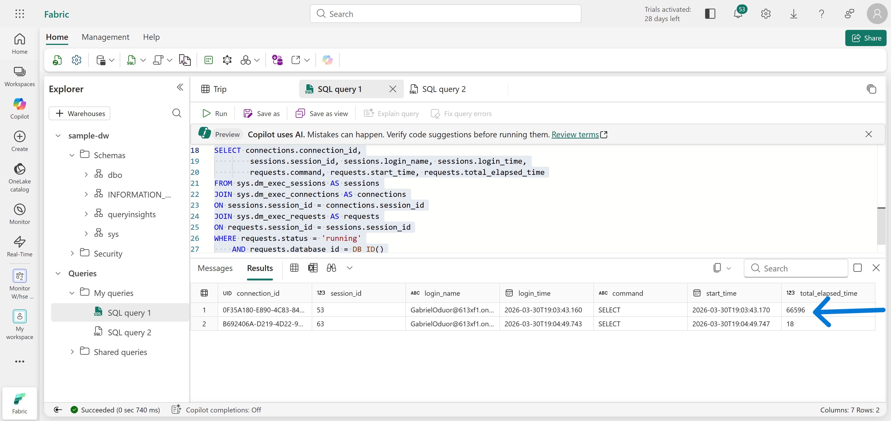
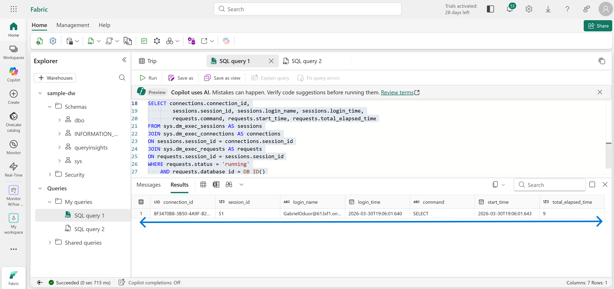
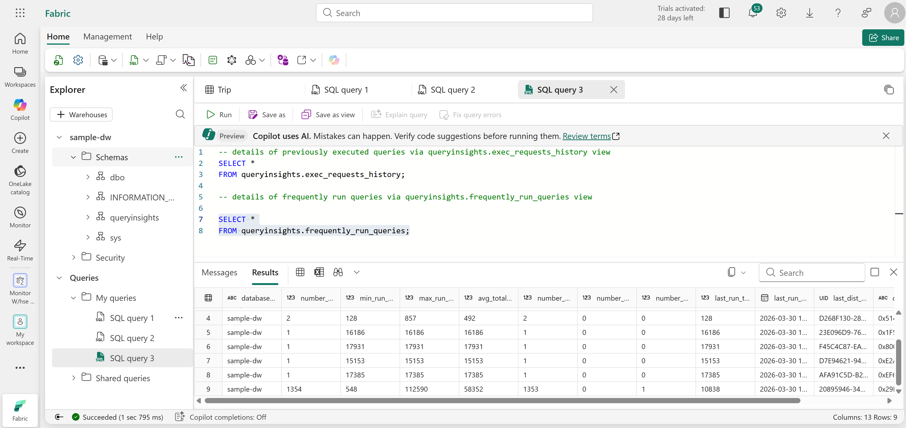
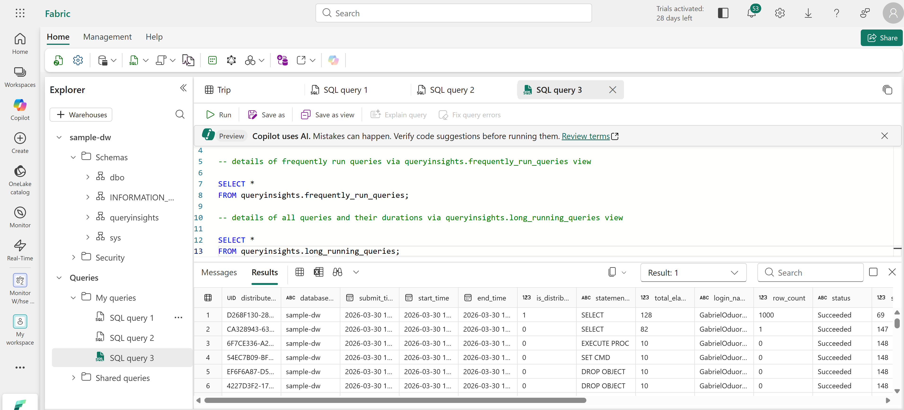

# Technical Breakdown

## Step 1 – Create Workspace

- Fabric workspace created with capacity enabled

---

## Step 2 – Create Sample Data Warehouse

Warehouse: `sample-dw`

- Preloaded taxi dataset

---

## Step 3 – Explore DMVs (Connections)

Query: `sys.dm_exec_connections`

Purpose: - Identify all active connections to the warehouse

---

## Step 4 – Explore DMVs (Sessions)

Query: `sys.dm_exec_sessions`

Purpose:

- View authenticated user sessions
- Analyze login activity

---

## Step 5 – Explore DMVs (Requests)

Query: `sys.dm_exec_requests`

Purpose: - Monitor currently executing queries

---

## Step 6 – Combine DMVs

- Joined connections, sessions, and requests
- Filtered for running queries only

Insights:

- Active query tracking
- Execution duration monitoring

---

## Step 7 – Simulate Long-Running Query

Query: `WHILE 1=1 SELECT * FROM Trip`

Purpose: - Generate workload for monitoring

---

## Step 8 – Monitor Live Execution

- Observed query in DMV results
- Tracked elapsed execution time
  

---

## Step 9 – Stop Query Execution

- Cancelled long-running query
- Verified removal from active sessions

---

## Step 10 – Explore Query Insights

### exec_requests_history

- Historical query execution details

---

### frequently_run_queries

- Identified commonly executed queries

---

### long_running_queries

- Analyzed performance-heavy queries

---

## Step 11 – Clean Up

- Workspace deleted after completion
