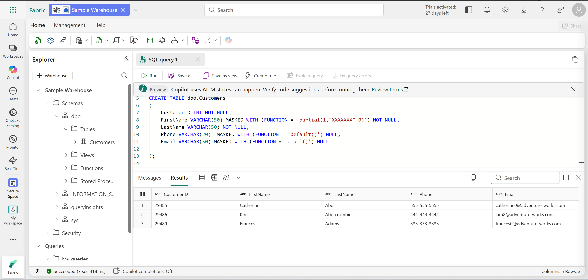
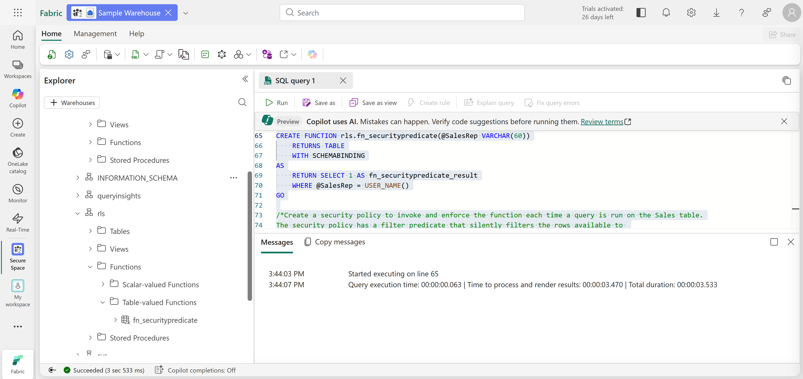
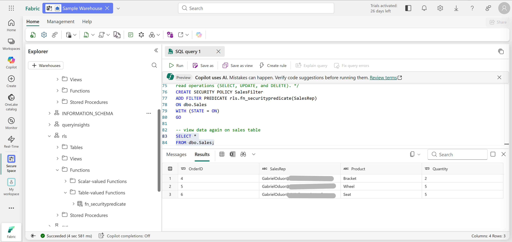
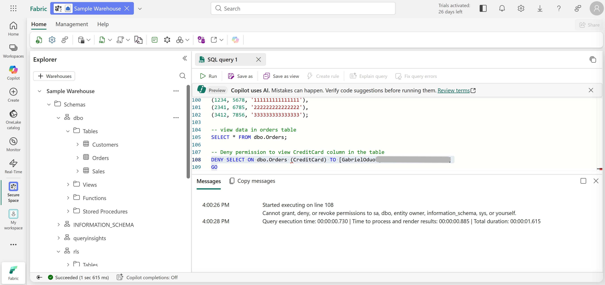
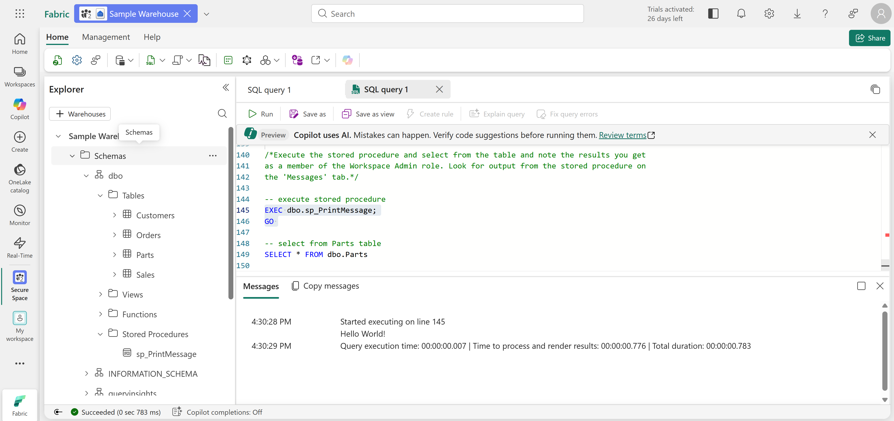

# Technical Breakdown

## Step 1 – Create Workspace

- Fabric workspace created with capacity enabled

---

## Step 2 – Create Data Warehouse

- New warehouse provisioned
- SQL endpoint enabled

---

## Step 3 – Implement Dynamic Data Masking

Table created: `dbo.Customers`

Masking applied:

- FirstName → partial mask
- Phone → default mask
- Email → email mask

Result:

- Admin → sees full data
- Viewer → sees masked values

---

## Step 4 – Implement Row-Level Security (RLS)

Table: `dbo.Sales`

Security components:

- Schema: `rls`
- Function: `fn_securitypredicate`
- Policy: `SalesFilter`

Logic: - Users only see their own rows

---

## Step 5 – Implement Column-Level Security (CLS)

Table: `dbo.Orders`

Security: - DENY SELECT on CreditCard column

Result: - Restricted users cannot access sensitive column

---

## Step 6 – Configure SQL Permissions

Objects created:

- Stored Procedure: `sp_PrintMessage`
- Table: `Parts`

Permissions applied:

- DENY SELECT on Parts
- GRANT EXECUTE on procedure

---

## Step 7 – Validate Security Behavior

Test scenarios:

- Admin access → full visibility
- Viewer access → restricted access

---

## Step 8 – Clean Up

- Workspace deleted after completion
