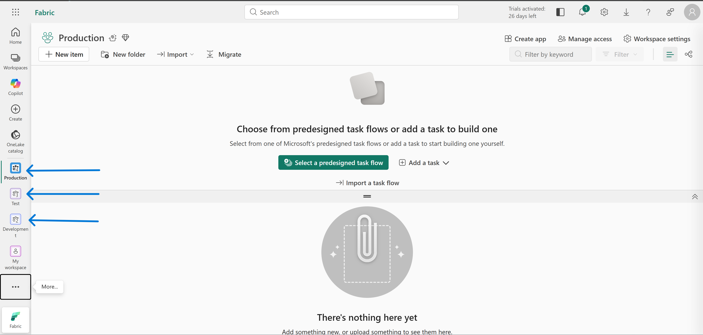
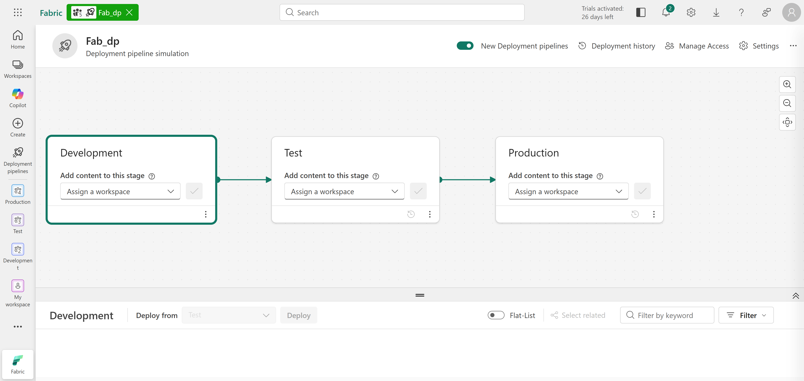
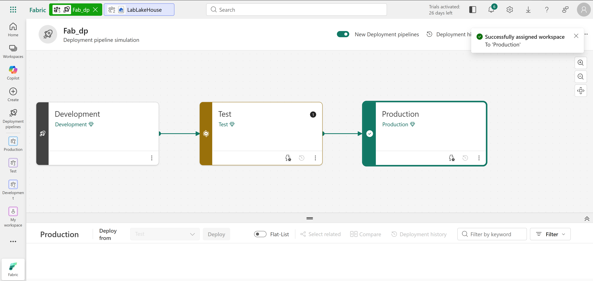
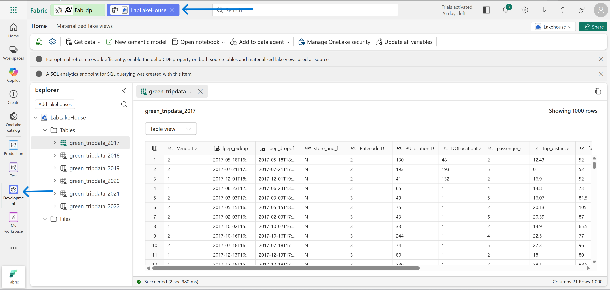
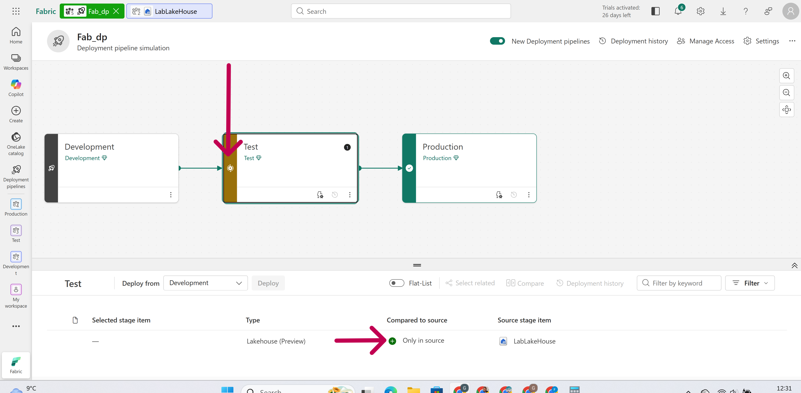
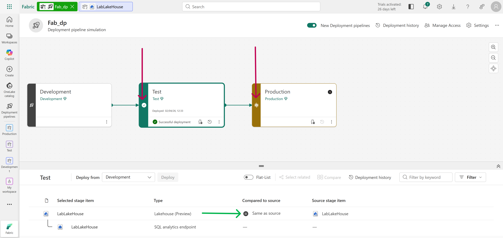
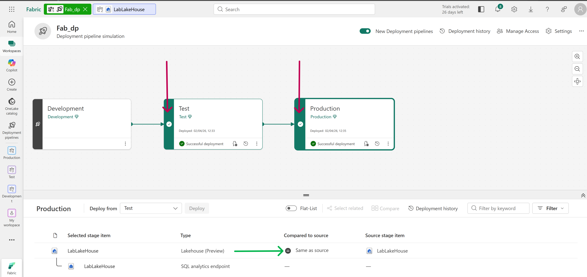
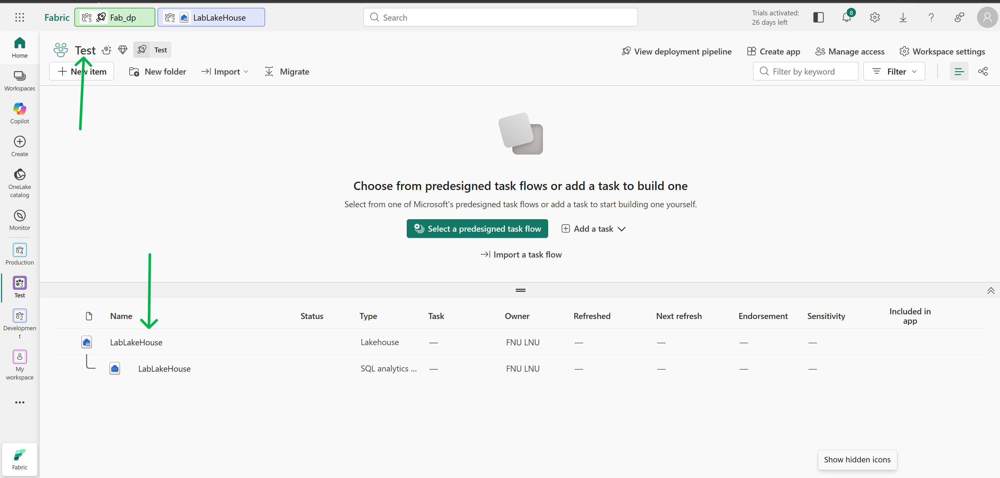
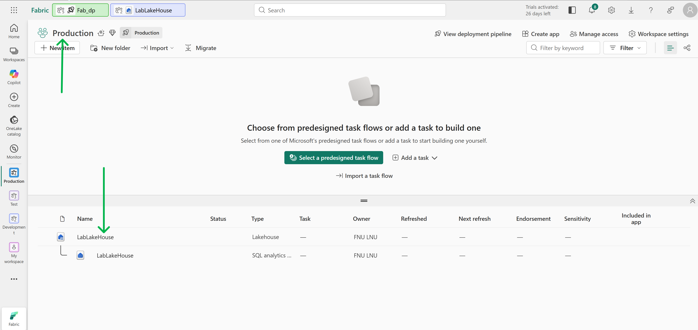

# Technical Breakdown

## Step 1 – Create Workspaces

Created three workspaces:

- Development
- Test
- Production

All configured with Fabric capacity.

---

## Step 2 – Create Deployment Pipeline

- New pipeline created
- Named appropriately (e.g., fabric-deployment-pipeline)

---

## Step 3 – Assign Workspaces to Pipeline Stages

Mapping:

- Development → Dev stage
- Test → Test stage
- Production → Prod stage

---

## Step 4 – Create Content in Development

Item created: - Lakehouse: `LabLakehouse`

Data source: - Sample dataset (NYC Taxi)

---

## Step 5 – Validate Pipeline State

- Dev contains lakehouse
- Test & Prod out of sync (`x` indicator)

---

## Step 6 – Deploy to Test Stage

- Selected lakehouse
- Deployed from Dev → Test

Result:

- Test workspace now contains lakehouse
- Prod still out of sync

---

## Step 7 – Deploy to Production Stage

- Deployed from Test → Production

Result: - All stages synchronized (✔ indicator)

---

## Step 8 – Validate Across Workspaces

Verified:

- Lakehouse exists in:
  - Development
  - Test
  - Production

---

## Step 9 – Clean Up

- Deleted deployment pipeline
- Removed all workspaces
