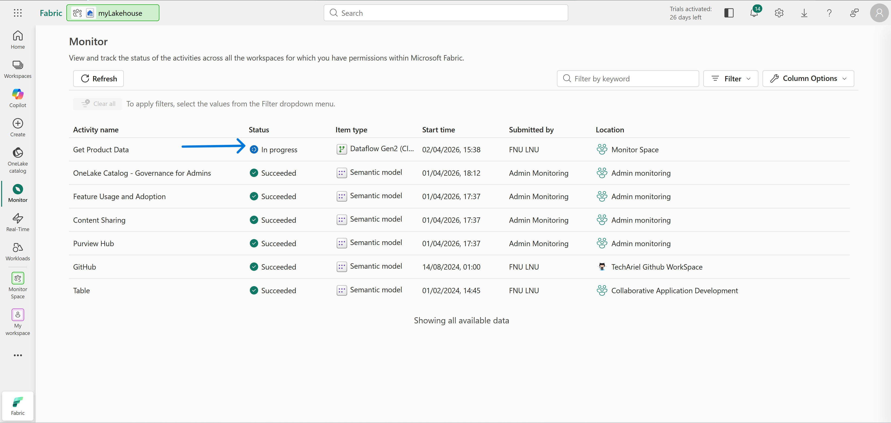
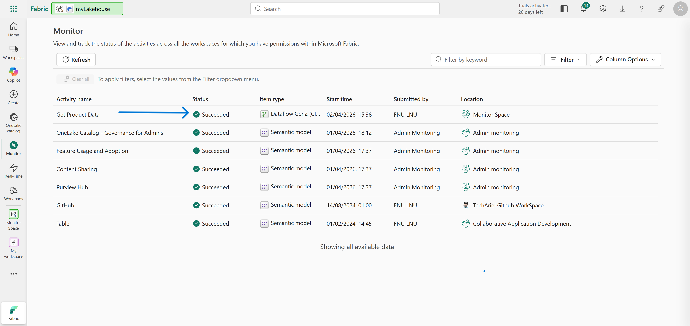
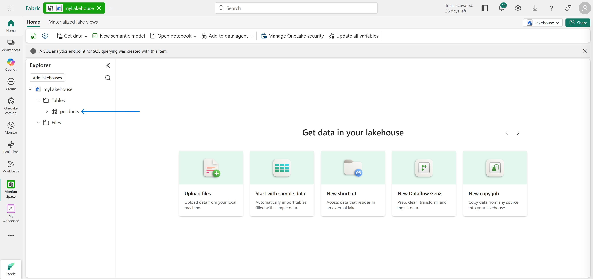
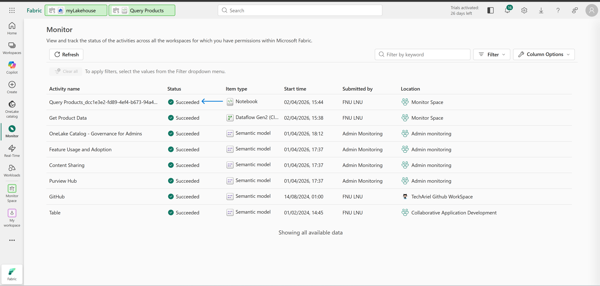
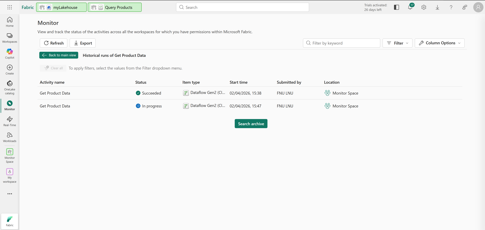
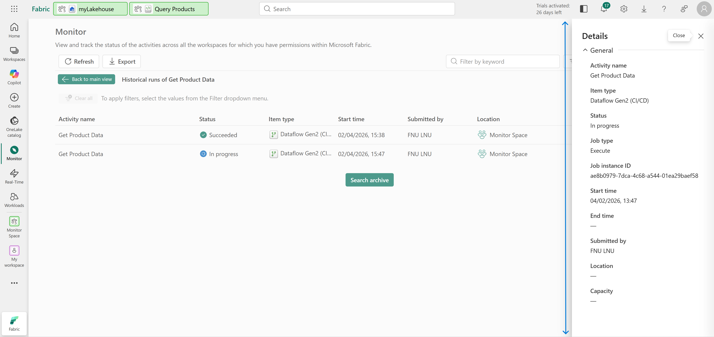
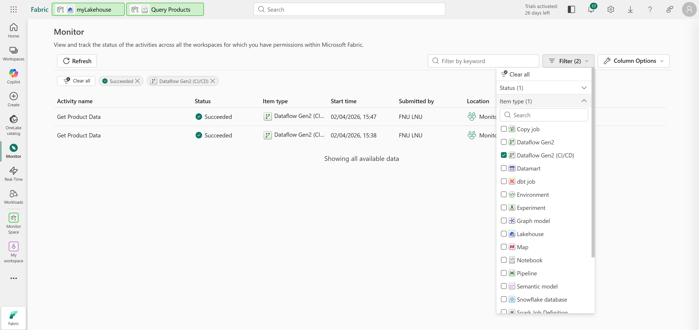
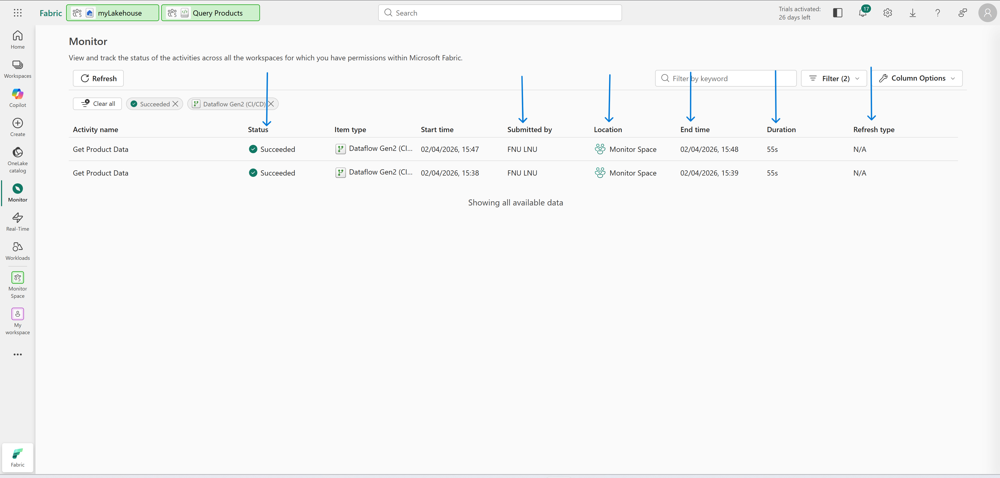

# Technical Breakdown

## Step 1 – Create Workspace

- Fabric workspace created with capacity enabled

---

## Step 2 – Create Lakehouse

- New lakehouse created
- Empty environment initialized

---

## Step 3 – Create Dataflow (Gen2)

Dataflow: - Name: `Get Product Data`

Source: - CSV file (products dataset)
[CSV Products File](https://raw.githubusercontent.com/MicrosoftLearning/dp-data/main/products.csv)

Output: - Table: `products` (lakehouse)

---

## Step 4 – Monitor Dataflow Execution

- Observed in Monitoring Hub
- Status tracked:
  - In-progress → Succeeded

---

## Step 5 – Validate Data Load

- products table created
- Data successfully ingested

---

## Step 6 – Create Spark Notebook

Notebook: - Name: `Query Products`

Actions:

- Connected to lakehouse
- Loaded products table
- Executed Spark query

---

## Step 7 – Monitor Notebook Activity

- Notebook execution visible in Monitoring Hub
- Spark session lifecycle tracked
  

---

## Step 8 – View Run History

- Re-ran Dataflow
- Accessed historical runs
- Viewed execution details

---

## Step 9 – Customize Monitoring Views

Filters applied:

- Status: Succeeded
- Item type: Dataflow Gen2

Columns added:

- Status
- Submitted by
- Location
- End time
- Duration
- Refresh type

---

## Step 10 – Clean Up

- Workspace deleted after completion
